# RSLAB

Rust Sparse Linear Algebra Backend. A sparse direct solver for real and complex
matrices: symmetric LDLᵀ (Bunch-Kaufman) and unsymmetric LU, with the factor
usable as a preconditioner. The solver core is pure Rust with no BLAS, LAPACK, or
MKL dependency.

[](LICENSE)

RSLAB factors `Pᵀ A P = L D Lᵀ` (complex-symmetric, PARDISO `mtype 6`) or
`Pᵀ A P = L U` (unsymmetric, `mtype 13`), then solves against one or many
right-hand sides. It is a fork of [feral](https://github.com/jkitchin/feral); see
[NOTICE](NOTICE).

## Features

- Pure-Rust solver core. No native dependencies. Optional bench/tooling features
  may load external libraries; the library does not.
- Generic over scalar type: `f64`, `f32`, `Complex<f64>`, `Complex<f32>`. A test
  factors and solves all four through both paths.
- Symmetric LDLᵀ with Bunch-Kaufman 1x1/2x2 pivoting (stores only `L`), and
  threshold-pivoted LU (exposed, tunable tolerance `u`) for unsymmetric matrices.
- **KLU path** for circuit-shaped matrices (`KluSymbolic::analyze → factor →
  KluSolver`): BTF (maximum transversal + Tarjan SCC, detects structural
  singularity a-priori) + per-block AMD + left-looking Gilbert-Peierls LU with
  threshold pivoting and row scaling. Strictly sequential and bit-deterministic;
  numeric-only `refactor` (frozen pattern + pivots) for frequency sweeps and
  Newton steps, plus `solve_transpose` (`Aᵀx = b` on the same factors) for
  adjoint / sensitivity solves. On MNA-like matrices: ~7x faster factor and ~6x less factor
  memory than the multifrontal LU, ~20x faster in a refactor sweep
  (`cargo bench --bench klu_circuit`).
- Three factorization schedules: supernodal left-looking (default, frees each dense
  panel after its last consumer), multifrontal, and right-looking.
- Fill-reducing orderings: AMD, AMF, nested dissection (METIS/Scotch/KaHIP), and
  RCM (band/profile), selectable or raced per matrix.
- Tunable equilibration (one-pass ∞-norm, iterative Ruiz, MC64 matching, off) and
  factor emit/memory mode, all through one flat `SolverSettings` interface.
- Learned auto-tuner, **one model per path** (symmetric LDLᵀ / unsymmetric LU):
  a small MLP selects the solver configuration (ordering incl. `MetisND`, method,
  amalgamation, threshold-pivot `u` on LU, equilibration, memory mode, kernel
  gates) per matrix from its structural features, guarded by a deterministic
  a-priori memory backstop so it never uses more memory than the default;
  out-of-distribution it falls back to a deterministic exact-fill ordering race.
  Trained on a complete-distribution corpus including generated curl-curl Maxwell
  (complex indefinite), Stokes/KKT saddle-point, and convection-diffusion (the
  unsymmetric LU class, swept over the grid-Péclet range) systems.
- **Runtime tuner profile** (no recompile): the two models plus hardware-calibrated
  guard thresholds ship as a `tuner_profile.json` config artifact. Point
  `RSLAB_TUNER_PROFILE` at one (or call `apply_profile`) to specialize the tuner to
  a machine or problem class. Produced by the **meta-tuner** `cargo xtask tune`
  (sweep → train → hardware-calibrate → assemble → held-out validate), which only
  writes a profile that passes a **ship-gate** (must not regress the shipped default
  on a held-out generator corpus). Calibration sets the deviate guard to the
  machine's own timing noise floor (`z·CV`), so the tuner never chases a predicted
  gain smaller than the measurement variance.
- The numeric factor is bit-identical across thread counts; the parallel multi-RHS
  solve (8-19x faster than per-column) is bit-identical to the serial path.
- 32-bit index compression (`CompressedLdltFactors`, when `n < 2^31`): half the
  index footprint at no accuracy cost.
- Static pivot reuse for fixed-pattern value sequences (frequency sweeps, time
  stepping): skip the pivot search across refactorizations.
- Preconditioner mode: static pivoting (never-fail), optional incomplete drop and
  block-low-rank compression.
- Iterative solvers: flexible restarted GMRES (single + block/multi-RHS), COCG,
  COCR, with warm start (`x0`) and GCRO-DR Krylov subspace recycling (a `Recycle`
  handle carried across a sequence of related solves) for solver-in-the-loop work.
- A-priori peak-memory and runtime estimates computed from the symbolic structure
  before any numeric work; scoped per-solve thread pools; per-call diagnostics; an
  optional hardware-aware budget planner.

## Benchmarks

Hardware: 12 cores / 24 threads, 24 workers. Compared against
[faer](https://github.com/sarah-quinones/faer-rs) (Rust sparse LU) and Intel MKL
PARDISO over a **genuinely complex** corpus spanning **both solver paths** and the
hard problem classes RSLAB targets (8k-125k DOFs, all `Complex<f64>`):

- **symmetric LDLᵀ** (vs PARDISO `mtype 6`): time-harmonic **curl-curl Maxwell**
  (complex indefinite, gradient near-null-space), shifted **Helmholtz**, and
  **Stokes/KKT saddle-point** (symmetric indefinite);
- **unsymmetric LU** (vs `mtype 13`): **convection-diffusion** (advection-dominated,
  swept over the grid-Péclet range) and **BEM/MoM** near-field kernels.

The generators are standard discretizations (curl-curl edge/Yee, MAC/mixed-FEM
saddle-point, convection-diffusion finite differences), assembled on structured
grids in `src/matgen/fem.rs`. Each path is measured on its own class in one run.
Reproduce: `RLA_BENCH_FAMILY=sym|unsym cargo bench --bench bench_suite --features
matgen`, then `head_to_head.py`.

### Per-path scaling: RSLAB vs faer vs MKL PARDISO

The two paths are separate solvers a caller dispatches to explicitly, so each is
plotted against *its own* PARDISO mtype and faer — factor time and peak memory vs
nonzeros, log-log, one power-law fit per solver.

**LDLᵀ path (symmetric, PARDISO mtype 6)** — factor time (left) and peak memory (right):

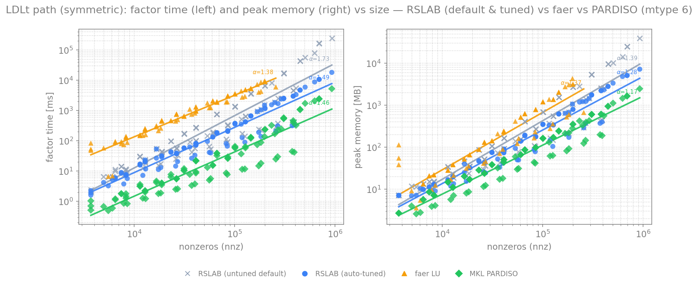

**LU path (unsymmetric, PARDISO mtype 13)** — factor time (left) and peak memory (right):

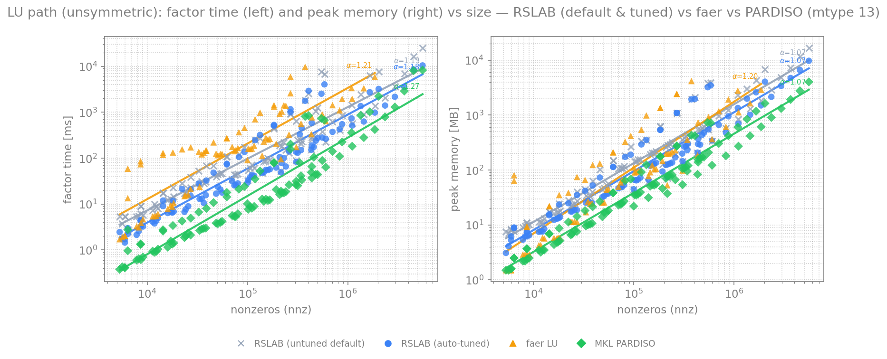

Each point is one corpus matrix; garbage solves (`‖Ax-b‖/‖b‖ > 0.1`) are excluded
from the fit.

Each plot shows two RSLAB curves — the **untuned default** (`SolverSettings::default()`,
gray) and the **auto-tuned** solver as shipped (`LdltSolver`/`LuSolver::factor`, blue) —
so the gap the learned tuner closes toward PARDISO is visible. **104 matrices per path**,
5k–1M nonzeros (the largest to 110k DOFs; faer OOMs on the biggest and factors only the
smaller subset).

Head-to-head (geomean over the matrices both solvers factor to `< 0.1` residual),
each path on its own class:

| RSLAB (auto-tuned) vs | LDLᵀ (sym) | LU (unsym) |
|-----------------------|:----------:|:----------:|
| **MKL PARDISO** — factor time | 5.8x slower | **3.9x slower** |
| **MKL PARDISO** — peak memory | 2.3x more | 2.4x more |
| **faer LU** — factor time | **6.9x faster** | **3.7x faster** |
| **faer LU** — peak memory | **2.3x less** | 1.1x less |
| **untuned default** — factor time | **1.82x faster** | **1.65x faster** |
| **untuned default** — peak memory | **0.68x** (less) | **0.71x** (less) |

RSLAB sits between the two: faster and lighter than the pure-Rust faer, moderately behind
the hand-optimized MKL PARDISO. The tuner rows are the learned tuner's win over the untuned
default on these hard classes — it closes a large part of the default→PARDISO distance
(visible as the gray→blue gap, widening with problem size, i.e. the tuner helps most on the
big matrices where a bad ordering costs most) **while using less memory than the default**
(0.68x/0.71x): the deterministic backstop compares the *exact* symbolic fill, so a pick can
never grow the factor beyond the default's. faer has no symmetric path (it factors sym
matrices as LU too), which is why its LDLᵀ gap is largest.

### Thread scaling


Geomean speedup over the complex corpus with a min-max band, 1 to 24 workers.
RSLAB reaches ~3.2x (left-looking) / ~3.0x (multifrontal) at 12-24 workers, with
some matrices reaching ~4.8x and others regressing past a few threads (a wide
band). Sparse-direct factorization concentrates work in a few large supernodes and
is largely memory-bandwidth bound, so the speedup caps well below linear. The wide
band - some matrices get *slower* past a few threads - is why RSLAB sets the worker
count per matrix:

### Auto-tuned thread count

RSLAB defaults to `Threads::Auto { max: 4 }`: it predicts the worker count from the
matrix structure (factor flops, front height, assembly-tree width) measured during
the symbolic analysis, **capped at 4** by default. Fit from the corpus
thread-scaling sweep, the predictor lands within **~10% of the per-matrix-optimal
count** (geomean), against ~50% for a fixed budget of 2 - thin / tiny systems stay
low (where extra threads only regress), bigger systems use up to the cap. The
default cap of 4 is the pareto-optimal throughput-per-core point; raise it
(`Threads::Auto { max: 0 }` = all cores) for a single big solve, or pin a
`Fixed(n)` budget for solver-in-the-loop (many concurrent solves).

### Auto-tuned solver settings

`LdltSolver::factor` / `LuSolver::factor_auto` pick the whole knob vector -
fill-reducing ordering, supernode amalgamation, and the kernel GEMM thresholds -
from the matrix's structural features. A small MLP performance model
`(features, knobs) -> (factor time, peak memory)`, trained offline on the corpus
knob sweep and embedded for **pure-Rust inference**, scores a candidate grid and
returns the config minimizing a weighted score `w·log(time) + (1-w)·log(mem)`;
the weight `w` slides between speed and memory.

**Memory is treated as the critical resource and never regresses.** The pick is
guarded on three levels: it only deviates from the default on a clear predicted
win; a deterministic a-priori backstop (exact fill + flops + the realistic memory
floor) rejects any config estimated to use more memory *or* more flops than the
default; and an out-of-distribution guard falls back to the default on matrices
larger than the model's training range (where it would otherwise extrapolate).

Measured end-to-end (`SolverSettings::default()` vs the tuner's pick), geomean,
**each path on its own class** (the two are separate models a caller dispatches to
explicitly), over **100+ matrices per path** (generated + SuiteSparse):

| path | balanced (w=0.7) | speed (w=1) | memory (w=0) |
|---|:---:|:---:|:---:|
| **LDLᵀ** (167 mat) | 1.33x / 0.83x | 1.35x / 0.85x | 1.24x / 0.79x |
| **LU** (97 mat) | **1.92x** / 0.72x | 1.95x / 0.75x | 1.61x / 0.81x |

(factor speedup / peak-memory ratio vs default). The auto-tuner is **faster and
lighter on both axes**, and **no matrix uses more memory than the default** (the
backstop guarantees it deterministically). The LU number is a coverage result: with
a handful of unsymmetric training matrices the LU tuner was neutral (1.02x);
broadening the unsymmetric set to 90 generated convection-diffusion problems
(grid-Péclet × flow × discretization) took its held-out R² from 0.75 to 0.98 and the
tuner from neutral to ~1.9x (up to 2.2x on the pure convection-diffusion class).

**LDLᵀ path — vs default by size, and the three Pareto modes:**

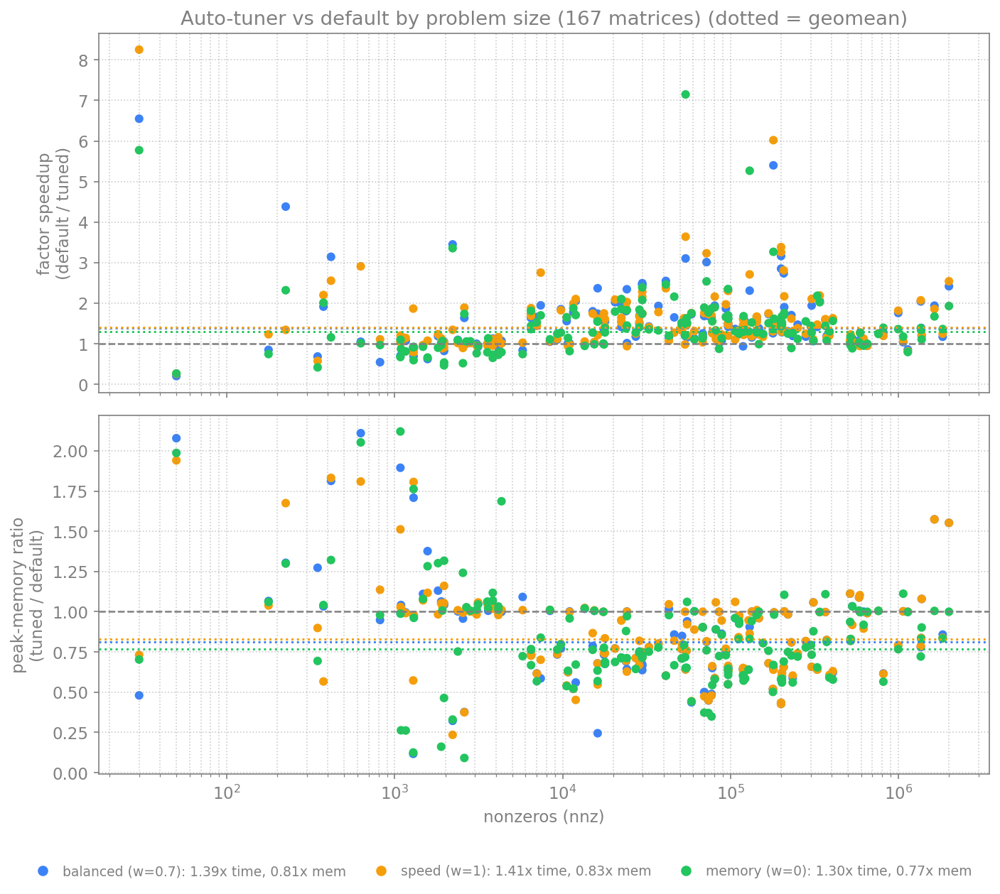
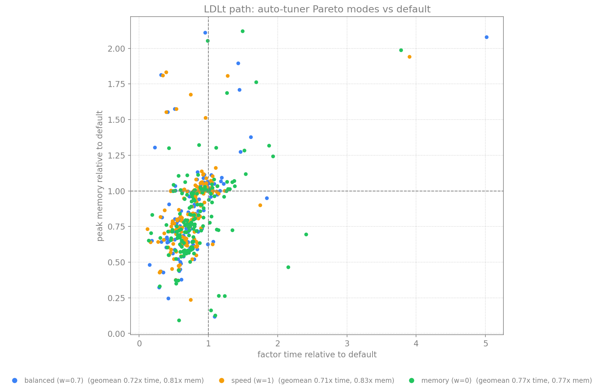

**LU path — vs default by size, and the three Pareto modes:**

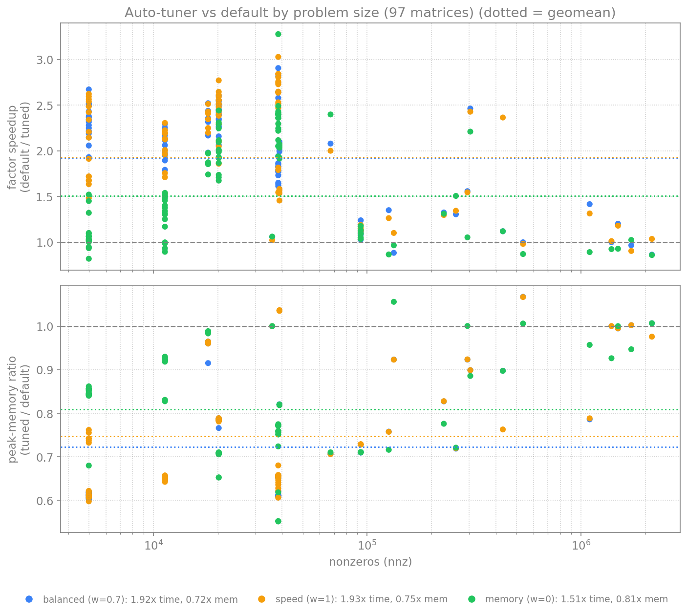
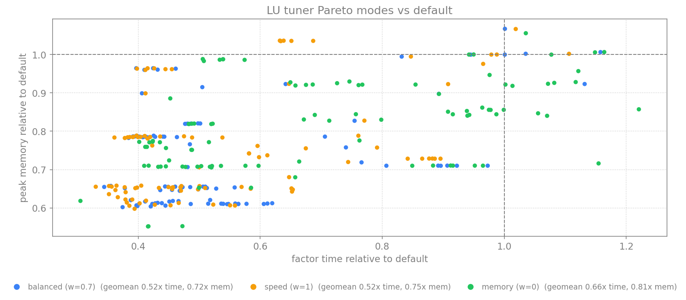

Each point is one matrix relative to the default; the weight `w` moves the cloud
along the time/memory trade-off. Peak memory is deterministically estimable
(fill/floor) so it is hard-guaranteed; factor time depends on BLAS-3 efficiency the
model predicts only approximately, so a few matrices see a small time regression
while still saving memory. The worker count stays with the `Threads::Auto`
predictor; `factor_with` opts out with explicit settings.

### Multi-RHS block GMRES scaling

`gmres_block` drives `s` right-hand sides in lockstep and orthogonalizes the whole
panel with **block-CGS2** (a parallel, panel-wide sweep) instead of per-RHS
Gram-Schmidt. Measured on a preconditioned convection-diffusion solve (n=40000, 78
GMRES iterations, `Complex<f64>`), the block solve now scales with threads where
the old per-RHS path was flat.

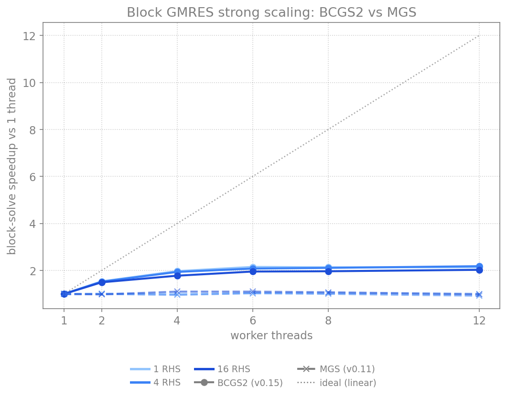

Strong scaling per block width: BCGS2 (v0.12, solid) reaches ~2.5x at 12 cores;
the pre-BCGS2 MGS path (v0.11, dashed) is flat-to-negative — its serial
orthogonalization does not scale at any thread count.

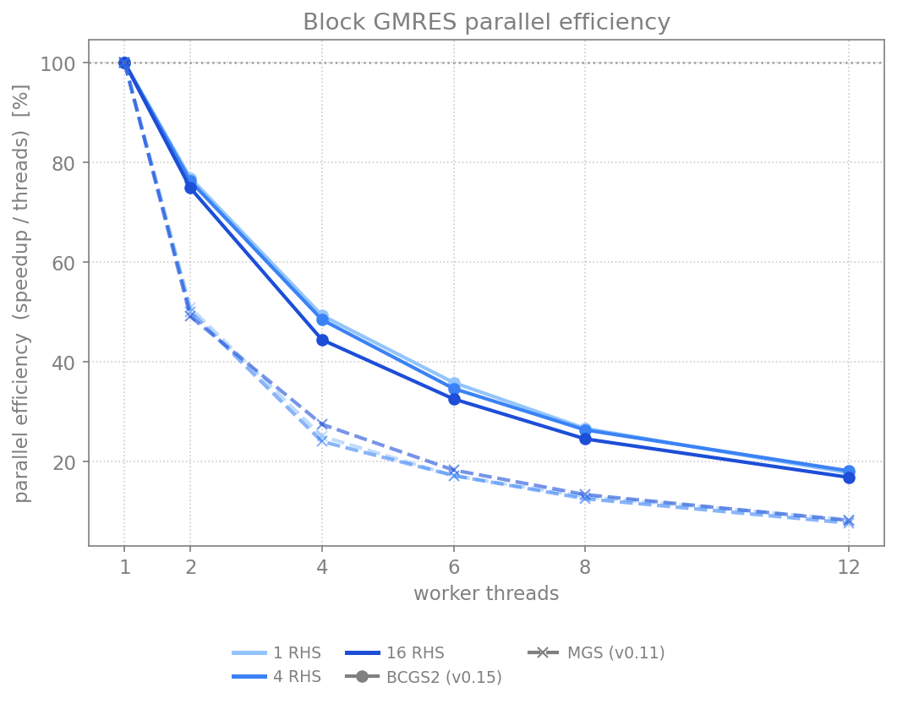
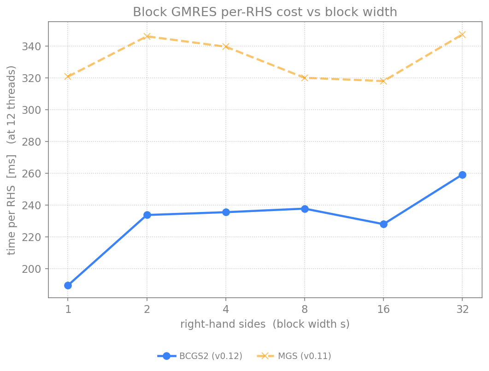

Efficiency knees at ~4–6 threads (the remaining serial fraction is the sparse
triangular preconditioner solve, not the orthogonalization). Per-RHS cost at 12
threads stays ~1.4–2.5x below the MGS reference across block widths, and near-flat
in `s` — adding right-hand sides stays cheap (BLAS-3 reuse). BCGS2 is memory-neutral
and bit-identical across thread counts. Cap the whole solve for embedded use with
`with_threads(n, …)`.

### Preconditioner + GMRES trade-off

Dropping fill below a relative `drop_tol` turns the exact factor into a
memory-light ILU-style preconditioner; GMRES then corrects it back to the true
solution. Bigger `drop_tol` → less fill but more iterations.

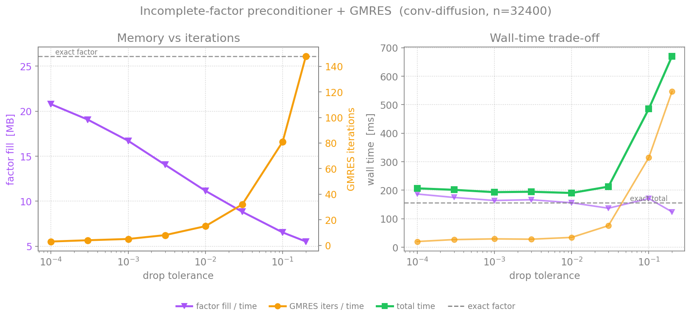

On a convection-diffusion system (n=32400) the factor fill drops ~2× (26 → 11 MB)
at `drop_tol=1e-2` while GMRES needs only ~15 iterations and the **total** wall
time stays within a few percent of the exact direct solve — a factor-memory
halving for free. Past ~3e-2 the iteration count climbs steeply and dominates, so
the useful range is bounded; the figure makes the sweet spot explicit.

### GCRO-DR Krylov subspace recycling

On a stagnating system (a cluster of small eigenvalues that restarted GMRES keeps
re-discovering), and across a *sequence* of related solves, `factor.recycle(k)`
carries `k` harmonic-Ritz vectors so the next solve deflates them from the start
instead of rebuilding the same subspace. Measured on a sequence of 8 related solves
(stagnation spectrum, n=20000): cold-start vs warm-start (`x0=`) vs GCRO-DR.

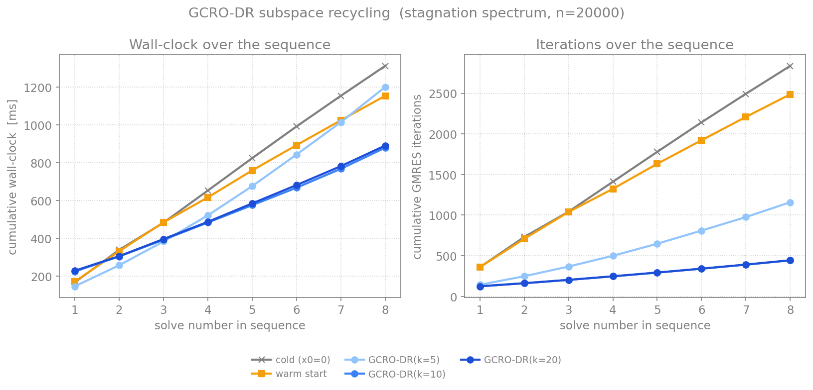

Recycling cuts the cross-solve iteration total **6.4×** vs cold (2837 → 444
iterations) for a ~1.5× wall-clock win after the recycle overhead; on the first
solve alone (within-solve deflated restarting) it is 2.9×. `k=20` overlaps `k=10`
because `k` is capped at `restart/2`.

### Block GMRES within-cycle deflation

A multi-RHS block whose columns converge at spread rates compacts a converged
column out of the batched applies **mid-cycle**, so the operator/preconditioner
applies shrink to the still-active width instead of dragging every column along
until the restart.

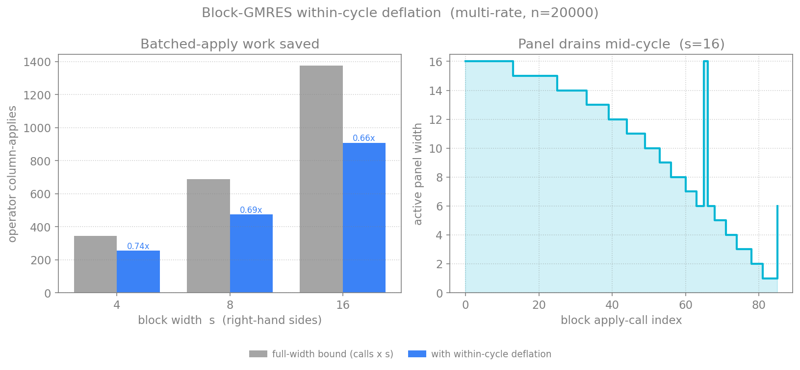

On a multi-rate testbed (n=20000) the panel drains from 16 to 1 within the first
cycle; at `s=16` the operator does 0.66× the column-applies a no-mid-cycle-deflation
schedule would.

### Adaptive GMRES restart under a memory budget

The Arnoldi basis is allocated up front, so `restart` fixes the memory floor. With
`restart=None` the Python binding caps it so the basis stays under 1 GiB
(clamped `[20,80]`); an explicit `restart=` is honoured exactly.

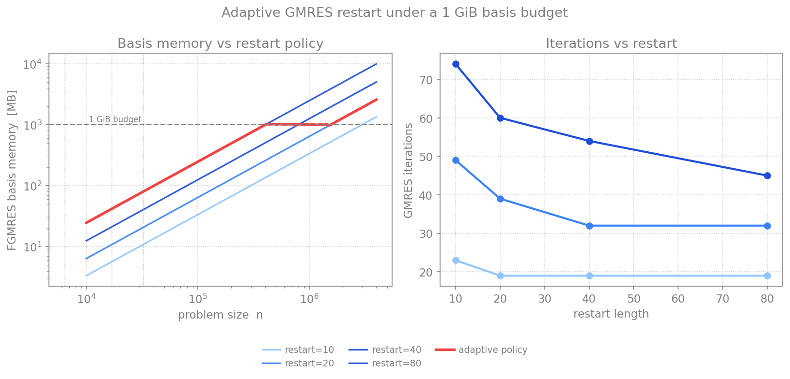

A longer restart cuts iterations with diminishing return; the adaptive policy rides
the maximum restart until the basis would exceed the budget, then declines to hold
memory flat — the longest restart that fits. Flexible GMRES additionally saves one
preconditioner solve per restart cycle by keeping the preconditioned `Z` basis
(`x += Z y`), so its total `M⁻¹` applies equal the iteration count.

### Accuracy (SuiteSparse)


Relative residual `‖Ax-b‖/‖b‖` as the accuracy check across the corpus.

- Where RSLAB factors, it is accurate: 24/31 matrices below `1e-8` residual, matching
  PARDISO and ahead of faer, which returns a degraded or garbage solution on several
  (pdb1HYS, bcsstk18, msc10848, wang3).
- Exact-mode limit: RSLAB's exact LDLᵀ (pivoting bounded to each supernode) cannot
  factor some indefinite saddle-point / KKT matrices (stokes64, bratu3d, cont-201) that
  PARDISO factors directly.
- Preconditioner mode covers most of that gap: a never-fail static-pivot factor used as
  a GMRES preconditioner reaches 28/33 below `1e-8` (matching PARDISO) and rescues the
  exact-mode failures bratu3d and cont-201; it also refines RSLAB's one inaccurate exact
  solve (qc2534, `3.6e-4` to `1.8e-13`). The hardest saddle-point/CFD cases (stokes64,
  ex11) stay out of reach. RSLAB targets the complex-symmetric EM/FEM regime, not
  general indefinite KKT.

### Where the time goes


Normalized analyze / factor / solve split per matrix, for both RSLAB paths
(left-looking and multifrontal). The numeric factor dominates (~80-95%); the
triangular solve is cheap; the analyze (fill-reducing ordering + symbolic) is a
small slice (larger on sparse circuit-like matrices such as `memplus`) - and is
**reusable** across value sets that share a pattern (next section).

### Phased reuse (analyze once, factor many)


A frequency sweep or Newton iteration factors many value sets that share one
sparsity pattern. `LdltSymbolic::analyze` runs the fill-reducing ordering and
symbolic analysis once (the value-independent part); each step then re-runs only
the numeric factor. The speedup of reusing that analysis over K factorizations
(vs re-analyzing each) rises from 1x at K=1 to its asymptote `1 + analyze/factor`:
up to ~1.25x for low-fill banded/2D (analysis ~20% of a solve), ~1.04x for
factor-dominated 3D - and it is the natural workflow for value sweeps.

### A-priori memory estimate vs measured


RSLAB estimates the factor-memory peak from the symbolic analysis alone, before
any numeric work, with a **separate model per path**: the left-looking estimate
(live panels + factor + input/scratch) and the multifrontal estimate (the
contribution-block-stack model - an assembly-tree level's fronts plus the live
CBs feeding its assembly, which the left-looking model does not capture). One
panel per path (log axis): each matrix's estimate (gray) next to its measured
peak. Both estimates stay above the measured peak (geomean ~1.5x LL, ~1.7x MF,
never
under-predicting across the corpus), so either is safe to compare against RAM for
fail-fast scheduling. Multifrontal genuinely holds more transiently (the CB
stack), which its own estimate now reflects.


The estimate's composition, normalized per matrix: the transient dense panels
dominate, the compact CSC factor (the kept output) is the next slice, and the
input + per-thread scratch a small remainder (relatively larger for small
matrices, where a fixed scratch floor shows).

### Real MoM matrices


On a private complex-MoM near-field dataset (RSLAB's target regime, which the
mostly-structural SuiteSparse corpus underrepresents) RSLAB left-looking uses less
time and memory than faer, and about half the memory of its own multifrontal path.

## Install

```toml
[dependencies]
rslab = "0.16"
```

### Python (NumPy / SciPy)

```bash
pip install rslab
```

```python
import numpy as np, scipy.sparse as sp, rslab
x = rslab.spsolve(A, b)              # one-shot (auto symmetric/unsymmetric)
f = rslab.ldlt(A); x = f.solve(b)    # factor once, solve many; also rslab.lu(A)

k = rslab.klu(A_circuit)             # circuit-shaped: BTF + Gilbert-Peierls
A_circuit.data *= 1.5                # sweep: same pattern, new values
k.refactor(A_circuit.data)           # numeric-only refactor, then solve again
```

A thin wrapper over the Rust core; the matrix dtype selects the field
(`float64`/`float32` real, `complex128`/`complex64` complex). All factor knobs
are keyword arguments (`threads`, `preconditioner`, `drop_tol`, `method`,
`memory` on `ldlt`/`lu`; `pivot_tol`, `row_scaling`, `btf` on `klu`). See
[`python/README.md`](python/README.md).

## Usage

### Symmetric direct solve (LDLᵀ)

```rust
use rslab::prelude::*;

// Real symmetric, lower triangle (i >= j).
let a = CscMatrix::<f64>::from_triplets(3, &[0, 1, 2, 1], &[0, 1, 2, 0],
                                        &[2.0, 2.0, 2.0, -1.0])?;
let sym = LdltSymbolic::analyze(&a)?;            // phase 1: analyze pattern once
let f   = sym.factor(&a, &FactorOptions::default())?;  // phases 2-3: factor
let x   = f.solve(&[1.0, 2.0, 3.0])?;            // solve A x = b
# Ok::<(), rslab::RslabError>(())
```

### Unsymmetric direct solve (LU)

```rust
use rslab::prelude::*;
use num_complex::Complex;

let c = |re, im| Complex::new(re, im);
let a = GeneralCsc::from_triplets(2, &[0, 1, 0, 1], &[0, 1, 1, 0],
                                  &[c(2., 0.), c(2., 0.), c(1., 0.), c(-1., 0.)])?;
let f = LuSymbolic::analyze(&a)?.factor(&a, &FactorOptions::default())?;
let x = f.solve(&[c(1., 0.), c(0., 1.)])?;
# Ok::<(), rslab::RslabError>(())
```

### Preconditioned iteration

```rust
use rslab::prelude::*;
# use num_complex::Complex;
# let c = |re, im| Complex::new(re, im);
# let a = CscMatrix::<Complex<f64>>::from_triplets(3, &[0,1,2,1], &[0,1,2,0],
#     &[c(4.,1.), c(4.,1.), c(4.,1.), c(-1.,0.2)])?;
// Static pivoting + incomplete drop give a never-fail preconditioner.
let opts = FactorOptions::preconditioner(1e-8).with_drop_tol(1e-2);
let m = LdltSolver::factor_with(&a, &opts)?;
let b = vec![c(1.0, 0.0); 3];
let res = cocg(&a, &b, &m, 1e-10, 100)?;
assert!(res.converged);
# Ok::<(), rslab::RslabError>(())
```

## API reference

### Phased workflow

Analyze-once, factor-many (PARDISO phases):

| Phase | Symmetric | Unsymmetric |
|-------|-----------|-------------|
| 1: analyze pattern | `LdltSymbolic::analyze(&a)` | `LuSymbolic::analyze(&a)` |
| 2-3: factor values | `sym.factor(&a, &opts)` -> `LdltSolver<T>` | `sym.factor(&a, &opts)` -> `LuSolver<T>` |
| solve | `f.solve(&b)` / `f.solve_many(&b, nrhs)` | `f.solve(&b)` / `f.solve_many(&b, nrhs)` |

One-shot: `LdltSolver::factor(&a)` / `LuSolver::factor(&a, &opts)`.

### FactorOptions

| Method | Effect |
|--------|--------|
| `preconditioner(floor)` / `exact()` | static-pivot preconditioner vs fail on singular pivot |
| `with_drop_tol(τ)` | drop fill below relative `τ` (incomplete factor) |
| `with_blr(BlrMode::…)` | block-low-rank compression of large fronts |
| `with_method(FactorMethod::…)` | `LeftLooking` (default) or `Multifrontal` |
| `with_threads(n)` | scoped pool of exactly `n` workers (`0` = all cores) |
| `with_thread_policy(Threads::…)` | `Auto{max}` (predict per matrix, capped; **default `max:4`**), `Fixed(n)`, or `Ambient` (use the current pool — no new spawn) |
| `with_memory(MemoryMode::…)` | transient-memory strategy |

The factor is bit-identical regardless of `threads`; the thread count affects time
and transient working set, not the result. The default caps at **4 workers** — the
pareto-optimal throughput-per-core point (the efficiency knee is ~4–6 threads) and
the safe default for concurrent / embedded use.

### Solver handles

```rust
# use rslab::prelude::*;
# fn demo(f: &LdltSolver<f64>, b: &[f64]) -> Result<(), rslab::RslabError> {
let x  = f.solve(b)?;                 // single RHS
let xs = f.solve_many(b, 4)?;         // 4 RHS at once (row-major n x nrhs)
let nnz = f.factor_nnz();             // fill (nnz of L, or L+U)
let d = f.diagnostics();              // per-call factor diagnostics
# Ok(()) }
```

### Diagnostics

`solver.diagnostics()` returns per-call, concurrency-safe data (no global state):
measured factor time, fill, thread count, and the a-priori `MemoryEstimate`.

### A-priori estimate

`sym.estimate_memory::<T>()` is a deterministic function of the analyzed structure,
callable before any numeric work:

```rust
use rslab::prelude::*;
use num_complex::Complex;
# fn demo(a: &CscMatrix<Complex<f64>>) -> Result<(), rslab::RslabError> {
let sym = LdltSymbolic::analyze(a)?;
let est = sym.estimate_memory::<Complex<f64>>();
let runtime_ms = est.est_runtime_ms(2.0, 4.0);   // gflops, parallel speedup
if !est.fits_in(8 << 30) { /* over 8 GiB */ }
# Ok(()) }
```

### Iterative solvers

`gmres`, `gmres_block`, `cocg`, `cocr` over any `LinearOperator` + `Preconditioner`.
A factor implements `Preconditioner`. A `Complex<f32>` factor can precondition an
`f64` GMRES via `LowPrecisionPreconditioner`.

`gmres_block` drives `s` right-hand sides in lockstep and orthogonalizes the whole
panel with **block-CGS2** — a parallel, panel-wide sweep instead of per-RHS
Gram-Schmidt — so the multi-RHS solve now scales across threads (~2.5x at 12 cores
on a deep-Krylov solve, where the old per-RHS path was flat) while staying
bit-identical across thread counts.

**Solver-in-the-loop thread capping.** The block orthogonalization runs on the
ambient rayon pool, so cap the whole solve with one pool: factor once (its own
bounded, `Auto{max:4}` pool), then run the RHS loop inside `with_threads(4, …)`:

```rust
# use rslab::{factor_general_lu, gmres_block, with_threads, SolverSettings, RslabError};
# use rslab::sparse::general::GeneralCsc;
# fn demo(a: &GeneralCsc<f64>, batches: &[Vec<f64>], s: usize) -> Result<(), RslabError> {
let lu = factor_general_lu(a, &SolverSettings::default())?;   // Auto{max:4}
with_threads(4, || {
    for rhs in batches { let _ = gmres_block(a, rhs, s, &lu, 1e-8, 400, 80)?; }
    Ok::<_, RslabError>(())
})?;
# Ok(()) }
```

Both phases stay on 4 cores with no per-call thread spawn. To also re-factor on the
shared pool (e.g. every Newton step), pass `Threads::Ambient` in the settings.

### Tuning (feature `tuning`)

```rust
# #[cfg(feature = "tuning")]
# fn demo(sym: &rslab::LuSymbolic) {
use rslab::tuning::{HardwareInfo, Calibration, Budget, plan};
let hw    = HardwareInfo::probe();              // cores + RAM
let calib = Calibration::load_or_measure(&hw);  // measured throughput, cached to disk
let est   = sym.estimate_memory::<f64>();
let budget = Budget { max_mem_bytes: Some(4 << 30), allow_mixed_precision: true,
                      allow_drop_tol: Some(1e-3), ..Default::default() };
let p = plan(&est, &budget, &hw, &calib);
// p.opts, p.use_mixed_precision, p.est_peak_bytes, p.est_runtime_ms, p.fits, p.note
# }
```

`plan` is a pure function of `(estimate, budget, hw, calibration)`. The thread
count it picks is cost-model-driven: the fewest cores that reach the near-minimum
predicted time, using an Amdahl critical-path floor from the assembly tree, so it
stops adding workers once the serial critical path (not total work) dominates. A
small learned residual (`benches/fit_residual.py`, `amdahl_frac`-driven, ~26%
held-out error reduction) refines the analytical speedup curve; it is additive on
the calibrated base and floored at the critical path, so it never extrapolates a
true chain into an impossible speedup.

### Meta-tuner (`cargo xtask`)

The offline pipeline that produces a `tuner_profile.json` (feature `tuning`):

```
cargo xtask calibrate                       # hardware microbench summary
cargo xtask tune   <workdir>                # sweep -> train -> profile -> ship-gate
cargo xtask profile <models_dir> <out> [class]   # assemble + ship-gate only
cargo xtask validate <profile.json>         # held-out geomean speedup vs default
```

`tune` runs the corpus sweep, trains the two per-path models, measures this
machine's calibration, assembles a candidate profile, and validates it on a
held-out generator corpus (curl-curl + saddle-point). The **ship-gate** writes the
profile only if it does not regress the shipped default. Load the result at runtime
with `RSLAB_TUNER_PROFILE=<path>` — no recompile.

### Test-matrix generators (feature `matgen`)

```rust
# #[cfg(feature = "matgen")]
# fn demo() {
use rslab::matgen::{self, stencil, bem};
let a = stencil::laplacian::<f64>(&[64, 64, 64], &stencil::StencilOpts::default());
let k = bem::kernel(8000, &bem::BemOpts::default());
for spec in matgen::catalog() { let _ = spec.name; }
# }
```

## Architecture

- Ordering: nested dissection (METIS/Scotch) with an AMD/AMF fallback selected by a
  size/structure heuristic.
- Left-looking supernodal (default): each panel pulls BLAS-3 updates from its
  factored descendants, then a blocked in-place panel factorization (Bunch-Kaufman
  for LDLᵀ, threshold partial pivoting for LU). Panels are compacted and freed once
  their last consumer is done.
- Multifrontal (opt-in): assembly tree of dense fronts.
- Parallelism: rayon over the assembly tree plus a SIMD (`gemm`) Schur update, in a
  scoped pool. Thread scaling saturates early because work concentrates in a few
  large top-of-tree supernodes.

## Determinism and scalar genericity

The `analyze -> factor -> solve` pipeline is generic over `Scalar`
(`f64`/`f32`/`Complex<f64>`/`Complex<f32>`); the estimator scales with
`size_of::<T>()`. The factor's `L`/`U`/`D` are bit-identical for any thread count,
and the estimates are pure functions of the symbolic structure.

## Cargo features

| Feature | Adds |
|---------|------|
| (default) | solver core, pure Rust |
| `matgen` | test-matrix generators + catalog |
| `matgen-download` | SuiteSparse / Matrix Market fetcher (pure-Rust HTTP/gzip/tar) |
| `tuning` | hardware probe + calibration cache + budget planner (pulls `sysinfo`) |

## License

MIT, Copyright (c) 2026 Milan Rother. RSLAB is a fork of feral
(https://github.com/jkitchin/feral), Copyright (c) 2026 John Kitchin, also MIT.
See [LICENSE](LICENSE) and [NOTICE](NOTICE).
