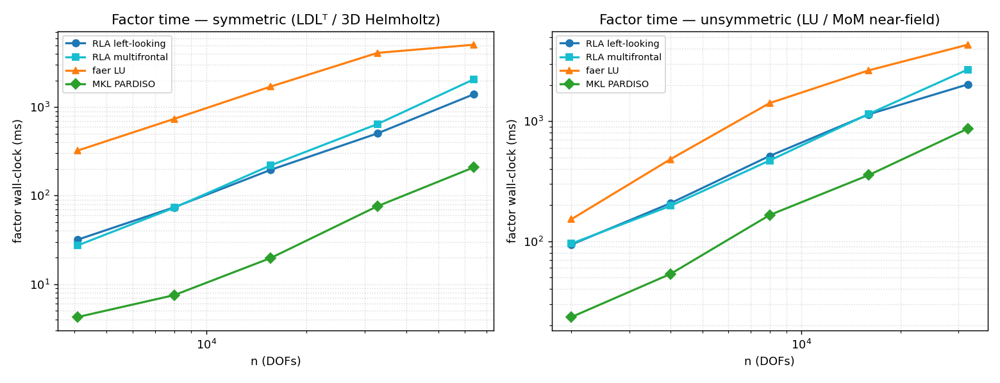
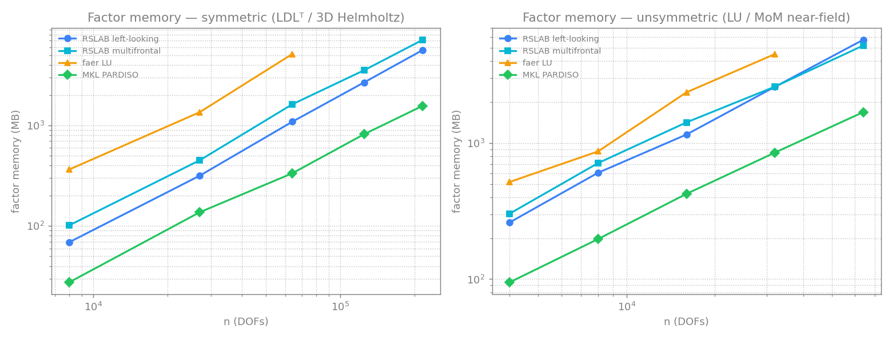
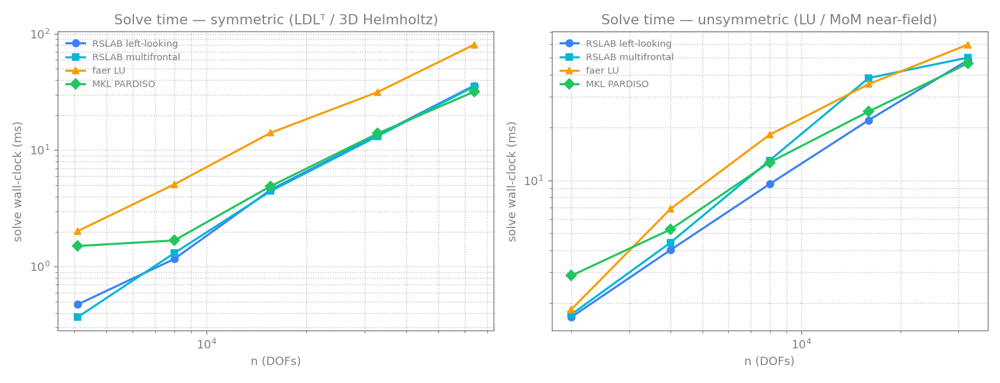
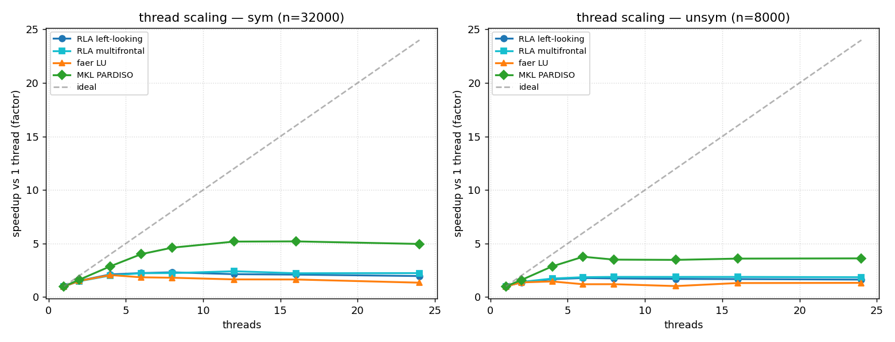
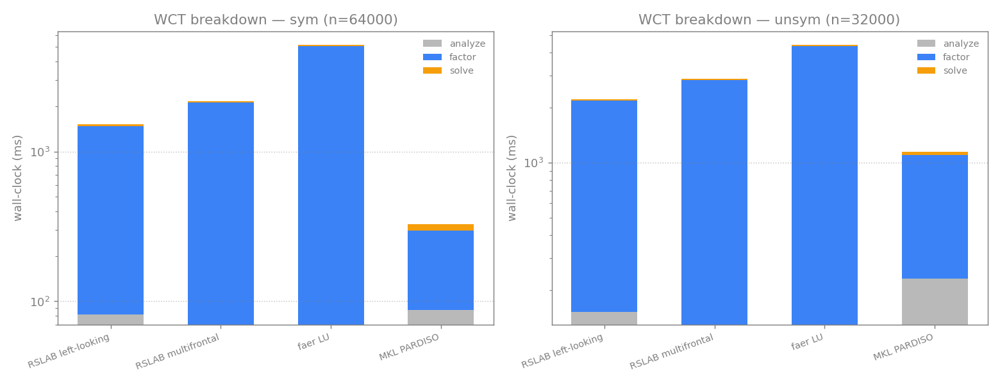
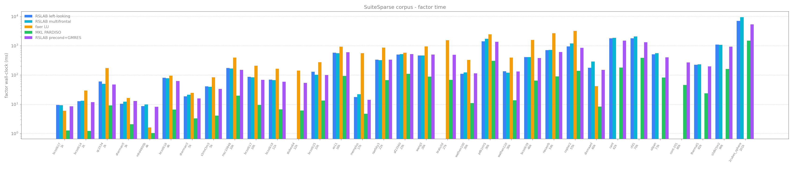
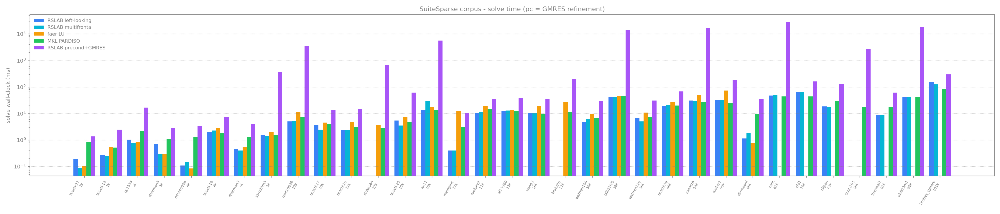
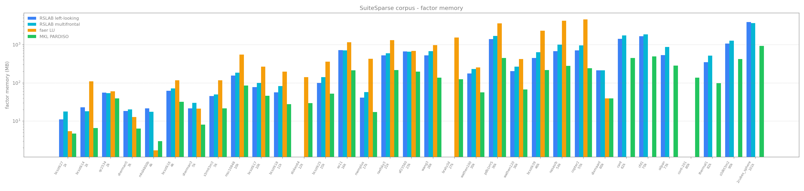

# RSLAB

Rust Sparse Linear Algebra Backend. A sparse direct solver for real and complex
matrices: symmetric LDLᵀ (Bunch-Kaufman) and unsymmetric LU, with the factor
usable as a preconditioner. The solver core is pure Rust with no BLAS, LAPACK, or
MKL dependency.

[](LICENSE)

RSLAB factors `Pᵀ A P = L D Lᵀ` (complex-symmetric, PARDISO `mtype 6`) or
`Pᵀ A P = L U` (unsymmetric, `mtype 13`), then solves against one or many
right-hand sides. It is a fork of [feral](https://github.com/jkitchin/feral); see
[NOTICE](NOTICE).

## Features

- Pure-Rust solver core. No native dependencies. Optional bench/tooling features
  may load external libraries; the library does not.
- Generic over scalar type: `f64`, `f32`, `Complex<f64>`, `Complex<f32>`. A test
  factors and solves all four through both paths.
- Symmetric LDLᵀ with Bunch-Kaufman 1x1/2x2 pivoting (stores only `L`), and
  threshold-pivoted LU for unsymmetric matrices.
- Supernodal left-looking factorization that frees each dense panel after its last
  consumer, plus a multifrontal path.
- The numeric factor is bit-identical across thread counts.
- Preconditioner mode: static pivoting (never-fail), optional incomplete drop and
  block-low-rank compression.
- Iterative solvers: restarted GMRES, block/multi-RHS GMRES, COCG, COCR.
- A-priori peak-memory and runtime estimates computed from the symbolic structure
  before any numeric work; scoped per-solve thread pools; per-call diagnostics; an
  optional hardware-aware budget planner.

## Benchmarks

Hardware: 12 cores / 24 threads. Compared against [faer](https://github.com/sarah-quinones/faer-rs)
(Rust sparse LU) and Intel MKL PARDISO. Test matrices: 3D complex-symmetric
Helmholtz (LDLᵀ path) and MoM near-field kernels (LU path); plus the real MoM
`precond_matrices`. faer factors the symmetric matrix as a full LU, so it is run
only up to where that is tractable; RSLAB and PARDISO continue to larger sizes.
Figures use transparent backgrounds. Reproduce with `python benches/run_bench.py`.

### Factor / solve time and memory vs DOFs





On these matrices RSLAB left-looking factors faster than faer and uses less
memory. PARDISO factors faster than both, with the same asymptotic slope as RSLAB.
The solve (triangular back-substitution) is cheap for all three.

### Thread scaling



PARDISO reaches about 5x, RSLAB about 2x before saturating. Sparse-direct
factorization concentrates work in a few large supernodes, which bounds the
achievable speedup (a standalone complex GEMM on the same machine scales about
10x). See [Architecture](#architecture).

### Wall-clock and memory breakdown




The memory breakdown is the a-priori estimate (no factoring required): dense panels
+ compact factor + input/scratch, with the panel-freed live floor marked. The
estimate is within 1.0x to 1.2x of measured peak across the sizes tested and does
not under-predict.

### Real MoM matrices


On the real matrices RSLAB left-looking uses less time and memory than faer, and
about half the memory of its own multifrontal path.

### Validation (SuiteSparse)

33 solvable matrices from the SuiteSparse collection (1k-100k DOFs; SPD, indefinite,
unsymmetric, complex), factored and solved against faer and PARDISO with the relative
residual `||Ax-b||/||b||` as the accuracy check (`python benches/run_bench.py --corpus-only`).






- Where RSLAB factors, it is accurate: 24/30 matrices below `1e-8` residual, matching
  PARDISO and ahead of faer, which returns a degraded or garbage solution on several
  (pdb1HYS, bcsstk18, msc10848, wang3).
- RSLAB factors faster and lighter than faer (geomean 1.9x time, 1.8x memory). PARDISO
  is faster and lighter than both on this mostly-structural corpus (about 7x time, 2.8x
  memory); the gap narrows on the larger complex EM/MoM matrices (see the scaling
  figures).
- Exact-mode limit: RSLAB's exact LDLᵀ (pivoting bounded to each supernode) cannot
  factor some indefinite saddle-point / KKT matrices (stokes64, bratu3d, cont-201) that
  PARDISO factors directly.
- Preconditioner mode covers most of that gap: a never-fail static-pivot factor used as
  a GMRES preconditioner reaches 28/33 below `1e-8` (matching PARDISO) and rescues the
  exact-mode failures bratu3d and cont-201; it also refines RSLAB's one inaccurate exact
  solve (qc2534, `3.6e-4` to `1.8e-13`). Its cost moves from the factor to the iteration
  (the solve-time figure). The hardest saddle-point/CFD cases (stokes64, ex11) stay out
  of reach. RSLAB targets the complex-symmetric EM/FEM regime, not general indefinite KKT.

## Install

```toml
[dependencies]
rslab = "0.11"
```

## Usage

### Symmetric direct solve (LDLᵀ)

```rust
use rslab::prelude::*;

// Real symmetric, lower triangle (i >= j).
let a = CscMatrix::<f64>::from_triplets(3, &[0, 1, 2, 1], &[0, 1, 2, 0],
                                        &[2.0, 2.0, 2.0, -1.0])?;
let sym = LdltSymbolic::analyze(&a)?;            // phase 1: analyze pattern once
let f   = sym.factor(&a, &FactorOptions::default())?;  // phases 2-3: factor
let x   = f.solve(&[1.0, 2.0, 3.0])?;            // solve A x = b
# Ok::<(), rslab::RslabError>(())
```

### Unsymmetric direct solve (LU)

```rust
use rslab::prelude::*;
use num_complex::Complex;

let c = |re, im| Complex::new(re, im);
let a = GeneralCsc::from_triplets(2, &[0, 1, 0, 1], &[0, 1, 1, 0],
                                  &[c(2., 0.), c(2., 0.), c(1., 0.), c(-1., 0.)])?;
let f = LuSymbolic::analyze(&a)?.factor(&a, &FactorOptions::default())?;
let x = f.solve(&[c(1., 0.), c(0., 1.)])?;
# Ok::<(), rslab::RslabError>(())
```

### Preconditioned iteration

```rust
use rslab::prelude::*;
# use num_complex::Complex;
# let c = |re, im| Complex::new(re, im);
# let a = CscMatrix::<Complex<f64>>::from_triplets(3, &[0,1,2,1], &[0,1,2,0],
#     &[c(4.,1.), c(4.,1.), c(4.,1.), c(-1.,0.2)])?;
// Static pivoting + incomplete drop give a never-fail preconditioner.
let opts = FactorOptions::preconditioner(1e-8).with_drop_tol(1e-2);
let m = LdltSolver::factor_with(&a, &opts)?;
let b = vec![c(1.0, 0.0); 3];
let res = cocg(&a, &b, &m, 1e-10, 100)?;
assert!(res.converged);
# Ok::<(), rslab::RslabError>(())
```

## API reference

### Phased workflow

Analyze-once, factor-many (PARDISO phases):

| Phase | Symmetric | Unsymmetric |
|-------|-----------|-------------|
| 1: analyze pattern | `LdltSymbolic::analyze(&a)` | `LuSymbolic::analyze(&a)` |
| 2-3: factor values | `sym.factor(&a, &opts)` -> `LdltSolver<T>` | `sym.factor(&a, &opts)` -> `LuSolver<T>` |
| solve | `f.solve(&b)` / `f.solve_many(&b, nrhs)` | `f.solve(&b)` / `f.solve_many(&b, nrhs)` |

One-shot: `LdltSolver::factor(&a)` / `LuSolver::factor(&a, &opts)`.

### FactorOptions

| Method | Effect |
|--------|--------|
| `preconditioner(floor)` / `exact()` | static-pivot preconditioner vs fail on singular pivot |
| `with_drop_tol(τ)` | drop fill below relative `τ` (incomplete factor) |
| `with_blr(BlrMode::…)` | block-low-rank compression of large fronts |
| `with_method(FactorMethod::…)` | `LeftLooking` (default) or `Multifrontal` |
| `with_threads(n)` | scoped pool of `n` workers (`0` = all cores, default 2) |
| `with_memory(MemoryMode::…)` | transient-memory strategy |

The factor is bit-identical regardless of `threads`; the thread count affects time
and transient working set, not the result.

### Solver handles

```rust
# use rslab::prelude::*;
# fn demo(f: &LdltSolver<f64>, b: &[f64]) -> Result<(), rslab::RslabError> {
let x  = f.solve(b)?;                 // single RHS
let xs = f.solve_many(b, 4)?;         // 4 RHS at once (row-major n x nrhs)
let nnz = f.factor_nnz();             // fill (nnz of L, or L+U)
let d = f.diagnostics();              // per-call factor diagnostics
# Ok(()) }
```

### Diagnostics

`solver.diagnostics()` returns per-call, concurrency-safe data (no global state):
measured factor time, fill, thread count, and the a-priori `MemoryEstimate`.

### A-priori estimate

`sym.estimate_memory::<T>()` is a deterministic function of the analyzed structure,
callable before any numeric work:

```rust
use rslab::prelude::*;
use num_complex::Complex;
# fn demo(a: &CscMatrix<Complex<f64>>) -> Result<(), rslab::RslabError> {
let sym = LdltSymbolic::analyze(a)?;
let est = sym.estimate_memory::<Complex<f64>>();
let runtime_ms = est.est_runtime_ms(2.0, 4.0);   // gflops, parallel speedup
if !est.fits_in(8 << 30) { /* over 8 GiB */ }
# Ok(()) }
```

### Iterative solvers

`gmres`, `gmres_block`, `cocg`, `cocr` over any `LinearOperator` + `Preconditioner`.
A factor implements `Preconditioner`. A `Complex<f32>` factor can precondition an
`f64` GMRES via `LowPrecisionPreconditioner`.

### Tuning (feature `tuning`)

```rust
# #[cfg(feature = "tuning")]
# fn demo(sym: &rslab::LuSymbolic) {
use rslab::tuning::{HardwareInfo, Calibration, Budget, plan};
let hw    = HardwareInfo::probe();              // cores + RAM
let calib = Calibration::load_or_measure(&hw);  // measured throughput, cached to disk
let est   = sym.estimate_memory::<f64>();
let budget = Budget { max_mem_bytes: Some(4 << 30), allow_mixed_precision: true,
                      allow_drop_tol: Some(1e-3), ..Default::default() };
let p = plan(&est, &budget, &hw, &calib);
// p.opts, p.use_mixed_precision, p.est_peak_bytes, p.est_runtime_ms, p.fits, p.note
# }
```

`plan` is a pure function of `(estimate, budget, hw, calibration)`.

### Test-matrix generators (feature `matgen`)

```rust
# #[cfg(feature = "matgen")]
# fn demo() {
use rslab::matgen::{self, stencil, bem};
let a = stencil::laplacian::<f64>(&[64, 64, 64], &stencil::StencilOpts::default());
let k = bem::kernel(8000, &bem::BemOpts::default());
for spec in matgen::catalog() { let _ = spec.name; }
# }
```

## Architecture

- Ordering: nested dissection (METIS/Scotch) with an AMD/AMF fallback selected by a
  size/structure heuristic.
- Left-looking supernodal (default): each panel pulls BLAS-3 updates from its
  factored descendants, then a blocked in-place panel factorization (Bunch-Kaufman
  for LDLᵀ, threshold partial pivoting for LU). Panels are compacted and freed once
  their last consumer is done.
- Multifrontal (opt-in): assembly tree of dense fronts.
- Parallelism: rayon over the assembly tree plus a SIMD (`gemm`) Schur update, in a
  scoped pool. Thread scaling saturates early because work concentrates in a few
  large top-of-tree supernodes.

## Determinism and scalar genericity

The `analyze -> factor -> solve` pipeline is generic over `Scalar`
(`f64`/`f32`/`Complex<f64>`/`Complex<f32>`); the estimator scales with
`size_of::<T>()`. The factor's `L`/`U`/`D` are bit-identical for any thread count,
and the estimates are pure functions of the symbolic structure.

## Cargo features

| Feature | Adds |
|---------|------|
| (default) | solver core, pure Rust |
| `matgen` | test-matrix generators + catalog |
| `matgen-download` | SuiteSparse / Matrix Market fetcher (pure-Rust HTTP/gzip/tar) |
| `tuning` | hardware probe + calibration cache + budget planner (pulls `sysinfo`) |

## License

MIT, Copyright (c) 2026 Milan Rother. RSLAB is a fork of feral
(https://github.com/jkitchin/feral), Copyright (c) 2026 John Kitchin, also MIT.
See [LICENSE](LICENSE) and [NOTICE](NOTICE).
