# RSLAB

Rust Sparse Linear Algebra Backend. A sparse direct solver for real and complex
matrices: symmetric LDLᵀ (Bunch-Kaufman) and unsymmetric LU, with the factor
usable as a preconditioner. The solver core is pure Rust with no BLAS, LAPACK, or
MKL dependency.

[](LICENSE)

RSLAB factors `Pᵀ A P = L D Lᵀ` (complex-symmetric, PARDISO `mtype 6`) or
`Pᵀ A P = L U` (unsymmetric, `mtype 13`), then solves against one or many
right-hand sides. It is a fork of [feral](https://github.com/jkitchin/feral); see
[NOTICE](NOTICE).

## Features

- Pure-Rust solver core. No native dependencies. Optional bench/tooling features
  may load external libraries; the library does not.
- Generic over scalar type: `f64`, `f32`, `Complex<f64>`, `Complex<f32>`. A test
  factors and solves all four through both paths.
- Symmetric LDLᵀ with Bunch-Kaufman 1x1/2x2 pivoting (stores only `L`), and
  threshold-pivoted LU for unsymmetric matrices.
- Supernodal left-looking factorization that frees each dense panel after its last
  consumer, plus a multifrontal path.
- The numeric factor is bit-identical across thread counts.
- Preconditioner mode: static pivoting (never-fail), optional incomplete drop and
  block-low-rank compression.
- Iterative solvers: restarted GMRES, block/multi-RHS GMRES, COCG, COCR.
- A-priori peak-memory and runtime estimates computed from the symbolic structure
  before any numeric work; scoped per-solve thread pools; per-call diagnostics; an
  optional hardware-aware budget planner.

## Benchmarks

Hardware: 12 cores / 24 threads. Compared against
[faer](https://github.com/sarah-quinones/faer-rs) (Rust sparse LU), Intel MKL
PARDISO, and SuperLU (via SciPy) over the SuiteSparse collection (1k-100k DOFs;
SPD, indefinite, unsymmetric, complex). Figures use transparent backgrounds.
Reproduce with the scripts in `benches/`: the `bench_suite` corpus engine +
`superlu_corpus.py` produce the data, then `fit_scaling.py` (scaling + accuracy),
`agg_thread_scaling_solvers.py` (thread scaling), and `corpus_breakdown.py`
(wall-clock + memory-estimate breakdown) render the figures.

### Scaling: factor time and peak memory vs problem size

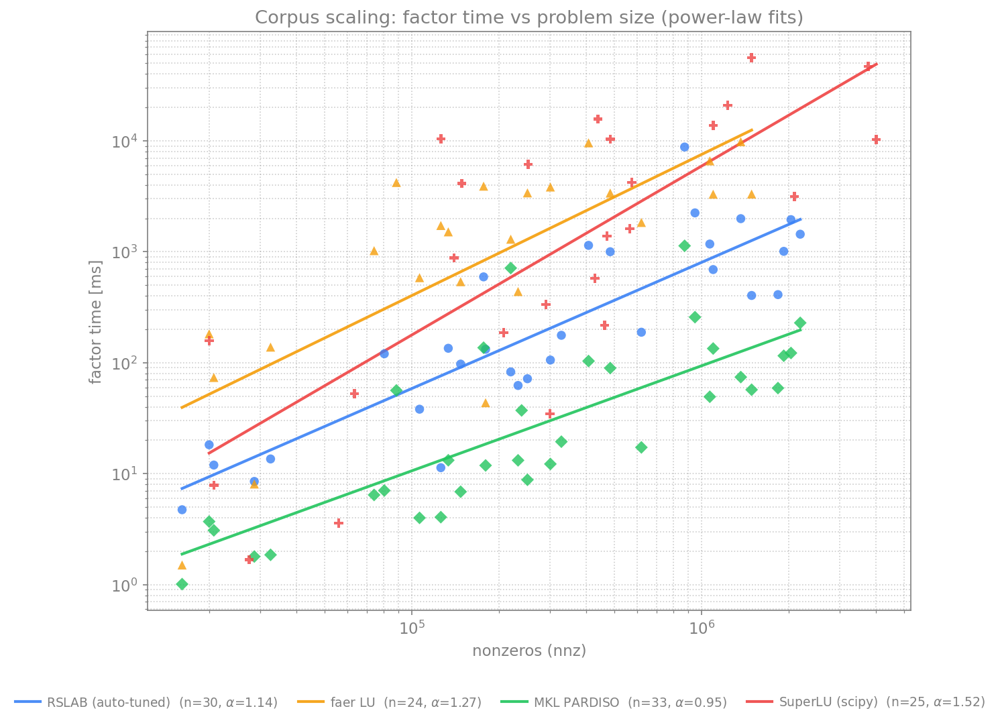
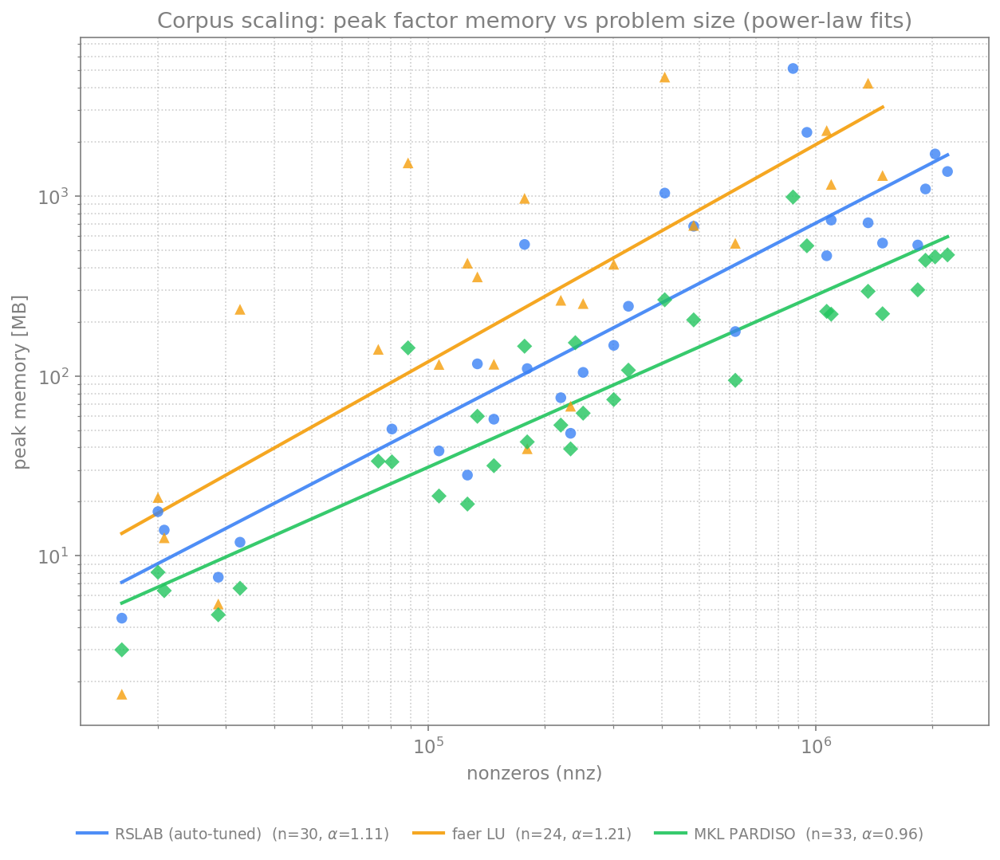

Each point is one corpus matrix; the line is a least-squares power-law fit
`~ nnz^α` (the empirical scaling order), garbage solves (`‖Ax-b‖/‖b‖ > 0.1`)
excluded from the fit.

The RSLAB curve is the **auto-tuned default** (`LdltSolver::factor` /
`LuSolver::factor`) - the solver as shipped, picking left-looking or multifrontal
per matrix under the memory / OOD guards (the two raw kernels are compared
separately in the memory-breakdown figure below). All four solvers were measured
in **one run** on the same machine, so the exponents are directly comparable.

| solver | factor time `α` | peak memory `α` |
|--------|:---------------:|:---------------:|
| MKL PARDISO         | **0.95** | **0.96** |
| RSLAB (auto-tuned)  | 1.14 | 1.11 |
| faer LU             | 1.27 | 1.21 |
| SuperLU (SciPy)²    | 1.52 | — |

RSLAB's auto-tuned default sits between PARDISO and faer on both axes: it beats
faer on both and SuperLU on factor time, and trails only PARDISO's decades-tuned
sublinear order. SuperLU does not exploit symmetry, so its fill (and factor time)
grows steeply (`1.52`).

² SuperLU is an open-source reference on the **time axis only**. Its peak memory
is sampled process RSS from a SciPy child (`splu` exposes no peak) — not comparable
to the in-process peaks and unreliable (0 MB on fast factorizations) — so it is
omitted from the memory comparison; and it runs single-threaded with a 60 s
per-matrix cap, so its 8 hardest corpus matrices are absent (survivor bias) and it
scatters over three orders of magnitude.

Head-to-head over the same run (geomean across the matrices both solvers factor
to `< 0.1` residual):

| RSLAB (auto) vs | factor time | peak memory |
|-----------------|:-----------:|:-----------:|
| MKL PARDISO | **7.1x slower** | 2.3x more |
| faer LU     | **7.0x faster** | **2.3x less** |
| SuperLU     | **8.9x faster** | n/a¹ |

¹ SuperLU's memory is sampled process RSS (SciPy), not the live-bytes peak the
in-process solvers report, so the two are not directly comparable. PARDISO is the
commercial reference (decades of hand-tuned kernels); RSLAB is a pure-Rust solver
that is several times faster and lighter than the other open-source options while
staying within a single-digit factor of MKL.

### Thread scaling

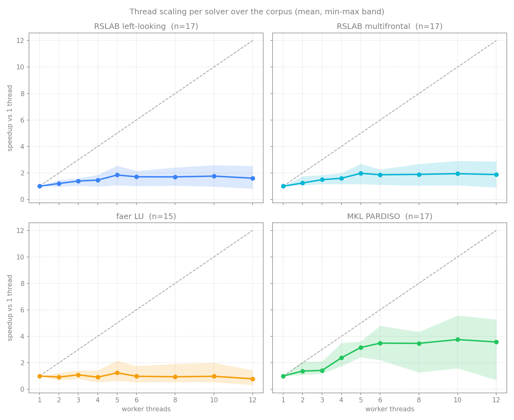

Mean speedup over the corpus with a min-max band, per solver, 1 to 12 workers.
PARDISO scales best (~3.5x, saturating around 6-10 threads); RSLAB reaches ~1.9x
(multifrontal) / ~1.8x (left-looking, peak near 5-6 threads); faer barely scales
and often regresses. Sparse-direct factorization concentrates work in a few large
supernodes and is largely memory-bandwidth bound, so the speedup caps well below
linear for every solver. The wide min-max band - some matrices get *slower* past
a few threads - is why RSLAB sets the worker count per matrix:

### Auto-tuned thread count

RSLAB defaults to `Threads::Auto`: it predicts the worker count from the matrix
structure (factor flops, front height, assembly-tree width) measured during the
symbolic analysis, capped at a user maximum. Fit from the corpus thread-scaling
sweep, this lands within **~10% of the per-matrix-optimal count** (geomean),
against ~50% for a fixed budget of 2 - thin / tiny systems stay low (where extra
threads only regress), big BLAS-3-rich systems use the cores. Override with a
fixed budget for solver-in-the-loop (many concurrent solves).

### Auto-tuned solver settings

`LdltSolver::factor` / `LuSolver::factor_auto` pick the whole knob vector -
fill-reducing ordering, supernode amalgamation, and the kernel GEMM thresholds -
from the matrix's structural features. A small MLP performance model
`(features, knobs) -> (factor time, peak memory)`, trained offline on the corpus
knob sweep and embedded for **pure-Rust inference**, scores a candidate grid and
returns the config minimizing a weighted score `w·log(time) + (1-w)·log(mem)`;
the weight `w` slides between speed and memory.

**Memory is treated as the critical resource and never regresses.** The pick is
guarded on three levels: it only deviates from the default on a clear predicted
win; a deterministic a-priori backstop (exact fill + flops + the realistic memory
floor) rejects any config estimated to use more memory *or* more flops than the
default; and an out-of-distribution guard falls back to the default on matrices
larger than the model's training range (where it would otherwise extrapolate).

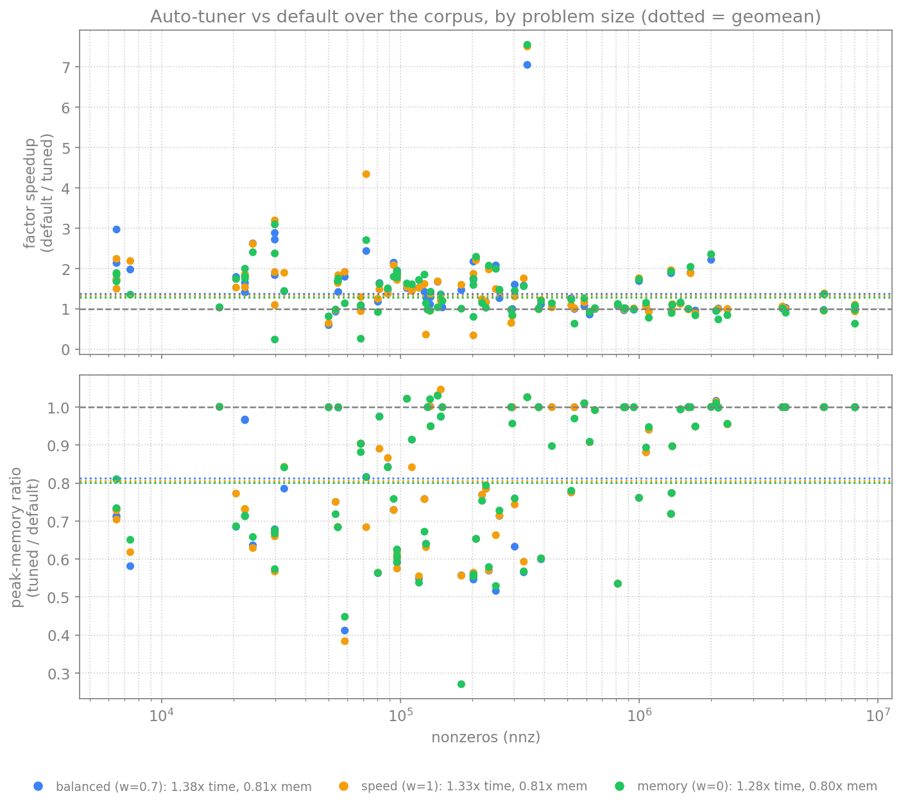

Measured end-to-end (`SolverSettings::default()` vs the tuner's pick) over the
corpus, geomean:

| mode | factor speedup | peak memory | over-default memory |
|---|---|---|---|
| balanced (`w=0.7`, default) | **1.38x** | **0.81x** | 0 / 89 matrices |
| speed (`w=1`) | 1.33x | 0.81x | 0 / 89 |
| memory (`w=0`) | 1.28x | **0.80x** | 0 / 89 |

The auto-tuner is **faster and lighter on both axes** - ~1.38x speedup *and* ~19%
lower peak memory - and **no matrix uses more memory than the default** (the
backstop guarantees it deterministically). The benefit holds across problem size
(small 1.6x, large 1.2x). Peak memory is deterministically estimable (fill/floor)
so it is hard-guaranteed; factor time depends on BLAS-3 efficiency the model
predicts only approximately, so a few matrices see a small time regression while
still saving memory. The worker count stays with the `Threads::Auto` predictor;
`factor_with` opts out with explicit settings.

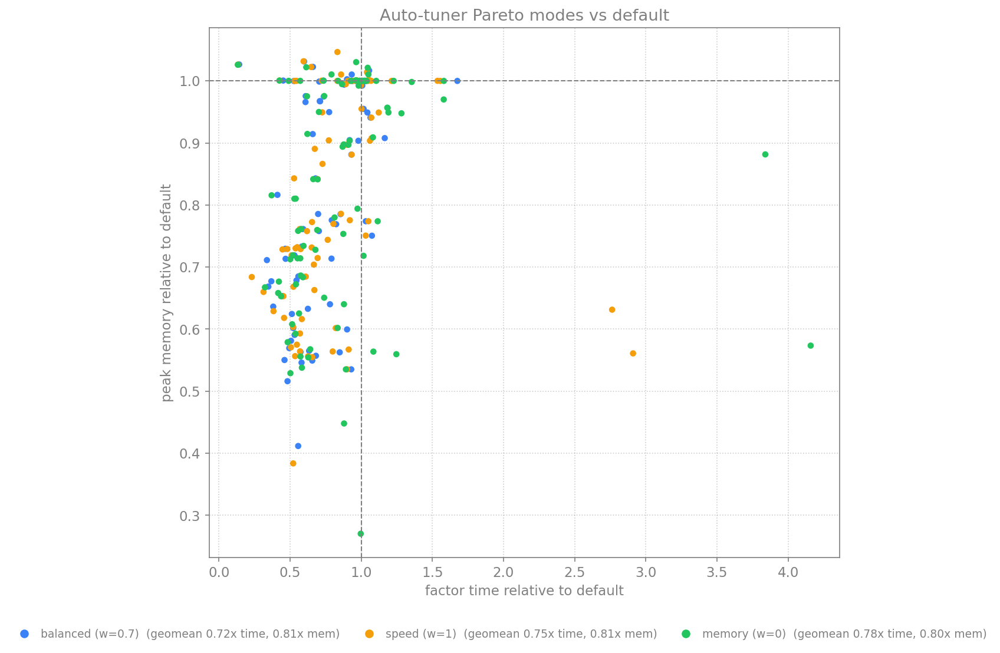

Each point is one matrix, relative to the default; the weight moves the cloud
along the time/memory trade-off.

### Accuracy (SuiteSparse)

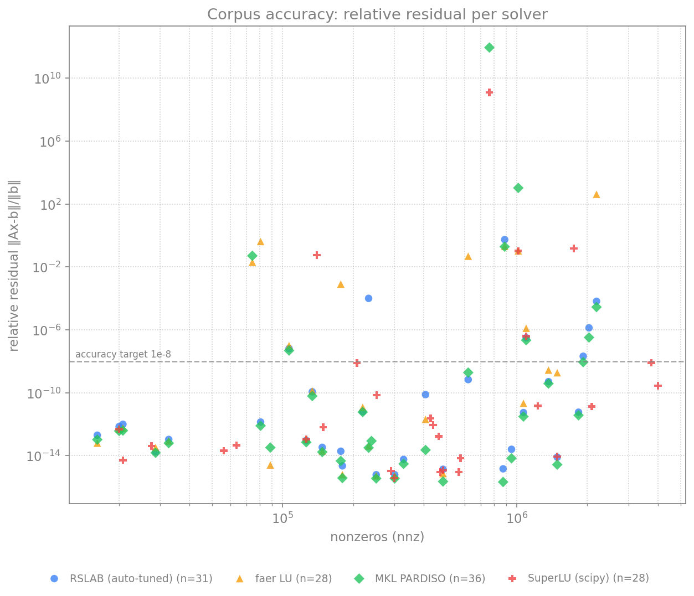

Relative residual `‖Ax-b‖/‖b‖` as the accuracy check across the corpus.

- Where RSLAB factors, it is accurate: 24/31 matrices below `1e-8` residual, matching
  PARDISO and ahead of faer, which returns a degraded or garbage solution on several
  (pdb1HYS, bcsstk18, msc10848, wang3).
- Exact-mode limit: RSLAB's exact LDLᵀ (pivoting bounded to each supernode) cannot
  factor some indefinite saddle-point / KKT matrices (stokes64, bratu3d, cont-201) that
  PARDISO factors directly.
- Preconditioner mode covers most of that gap: a never-fail static-pivot factor used as
  a GMRES preconditioner reaches 28/33 below `1e-8` (matching PARDISO) and rescues the
  exact-mode failures bratu3d and cont-201; it also refines RSLAB's one inaccurate exact
  solve (qc2534, `3.6e-4` to `1.8e-13`). The hardest saddle-point/CFD cases (stokes64,
  ex11) stay out of reach. RSLAB targets the complex-symmetric EM/FEM regime, not
  general indefinite KKT.

### Where the time goes

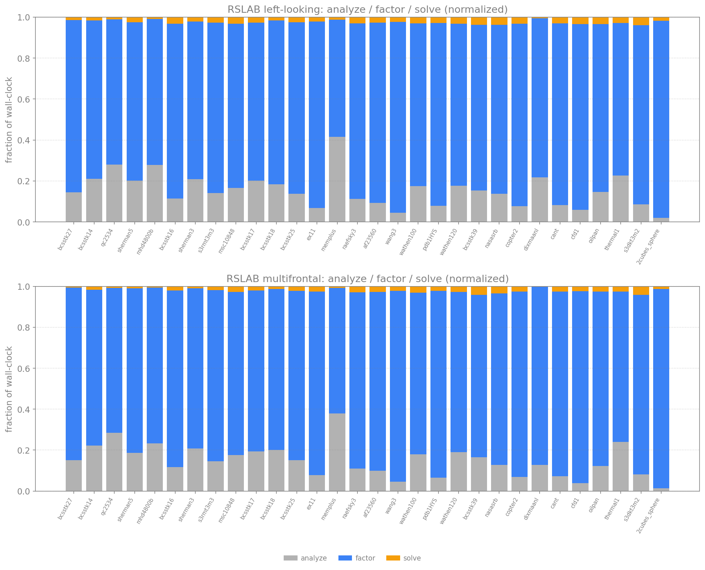

Normalized analyze / factor / solve split per matrix, for both RSLAB paths
(left-looking and multifrontal). The numeric factor dominates (~80-95%); the
triangular solve is cheap; the analyze (fill-reducing ordering + symbolic) is a
small slice (larger on sparse circuit-like matrices such as `memplus`) - and is
**reusable** across value sets that share a pattern (next section).

### Phased reuse (analyze once, factor many)

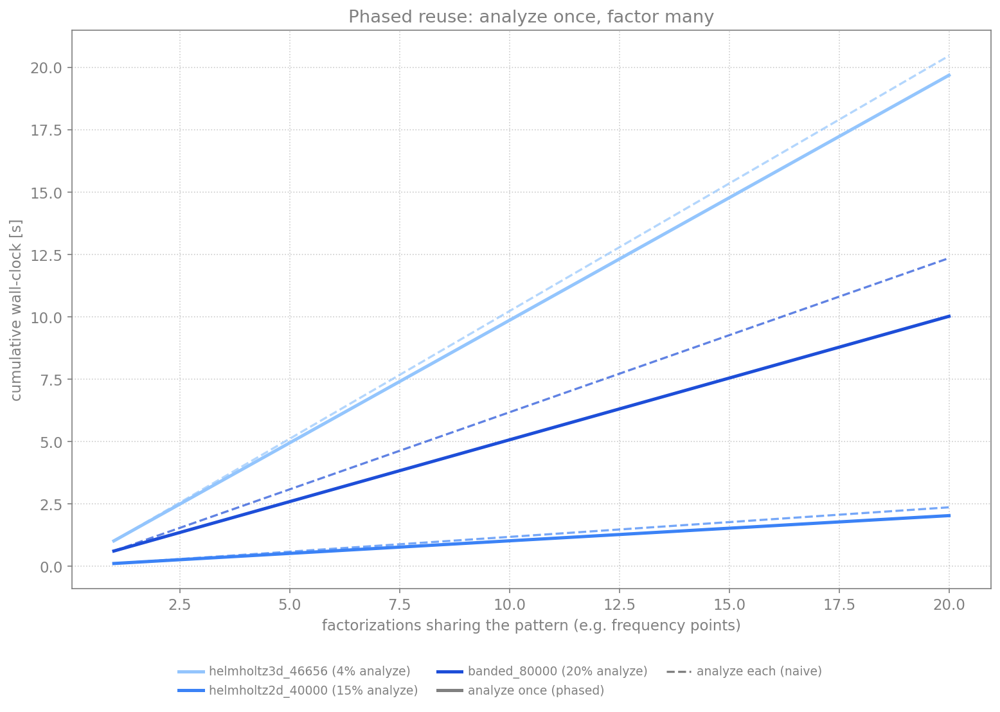

A frequency sweep or Newton iteration factors many value sets that share one
sparsity pattern. `LdltSymbolic::analyze` runs the fill-reducing ordering and
symbolic analysis once (the value-independent part); each step then re-runs only
the numeric factor. The speedup of reusing that analysis over K factorizations
(vs re-analyzing each) rises from 1x at K=1 to its asymptote `1 + analyze/factor`:
up to ~1.25x for low-fill banded/2D (analysis ~20% of a solve), ~1.04x for
factor-dominated 3D - and it is the natural workflow for value sweeps.

### A-priori memory estimate vs measured

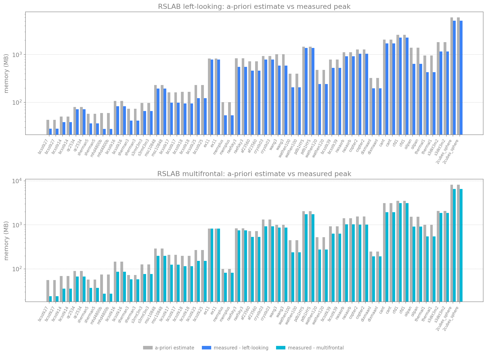

RSLAB estimates the factor-memory peak from the symbolic analysis alone, before
any numeric work, with a **separate model per path**: the left-looking estimate
(live panels + factor + input/scratch) and the multifrontal estimate (the
contribution-block-stack model - an assembly-tree level's fronts plus the live
CBs feeding its assembly, which the left-looking model does not capture). One
panel per path (log axis): each matrix's estimate (gray) next to its measured
peak. Both estimates stay above the measured peak (geomean ~1.5x LL, ~1.7x MF,
never
under-predicting across the corpus), so either is safe to compare against RAM for
fail-fast scheduling. Multifrontal genuinely holds more transiently (the CB
stack), which its own estimate now reflects.

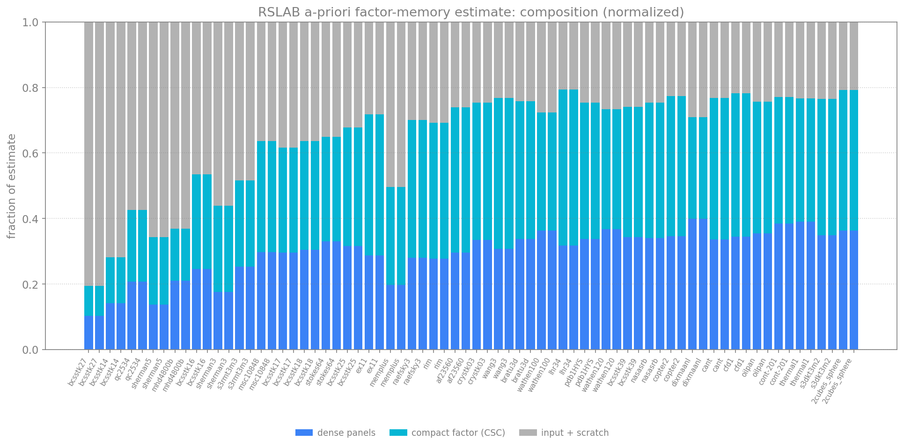

The estimate's composition, normalized per matrix: the transient dense panels
dominate, the compact CSC factor (the kept output) is the next slice, and the
input + per-thread scratch a small remainder (relatively larger for small
matrices, where a fixed scratch floor shows).

### Real MoM matrices

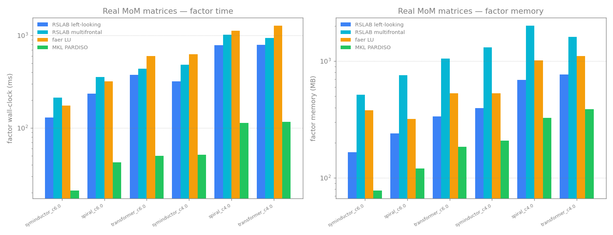

On a private complex-MoM near-field dataset (RSLAB's target regime, which the
mostly-structural SuiteSparse corpus underrepresents) RSLAB left-looking uses less
time and memory than faer, and about half the memory of its own multifrontal path.

## Install

```toml
[dependencies]
rslab = "0.11"
```

### Python (NumPy / SciPy)

```bash
pip install rslab
```

```python
import numpy as np, scipy.sparse as sp, rslab
x = rslab.spsolve(A, b)              # one-shot (auto symmetric/unsymmetric)
f = rslab.ldlt(A); x = f.solve(b)    # factor once, solve many; also rslab.lu(A)
```

A thin wrapper over the Rust core; the matrix dtype selects the field
(`float64`/`float32` real, `complex128`/`complex64` complex). All factor knobs
are keyword arguments (`threads`, `preconditioner`, `drop_tol`, `method`,
`memory`). See [`python/README.md`](python/README.md).

## Usage

### Symmetric direct solve (LDLᵀ)

```rust
use rslab::prelude::*;

// Real symmetric, lower triangle (i >= j).
let a = CscMatrix::<f64>::from_triplets(3, &[0, 1, 2, 1], &[0, 1, 2, 0],
                                        &[2.0, 2.0, 2.0, -1.0])?;
let sym = LdltSymbolic::analyze(&a)?;            // phase 1: analyze pattern once
let f   = sym.factor(&a, &FactorOptions::default())?;  // phases 2-3: factor
let x   = f.solve(&[1.0, 2.0, 3.0])?;            // solve A x = b
# Ok::<(), rslab::RslabError>(())
```

### Unsymmetric direct solve (LU)

```rust
use rslab::prelude::*;
use num_complex::Complex;

let c = |re, im| Complex::new(re, im);
let a = GeneralCsc::from_triplets(2, &[0, 1, 0, 1], &[0, 1, 1, 0],
                                  &[c(2., 0.), c(2., 0.), c(1., 0.), c(-1., 0.)])?;
let f = LuSymbolic::analyze(&a)?.factor(&a, &FactorOptions::default())?;
let x = f.solve(&[c(1., 0.), c(0., 1.)])?;
# Ok::<(), rslab::RslabError>(())
```

### Preconditioned iteration

```rust
use rslab::prelude::*;
# use num_complex::Complex;
# let c = |re, im| Complex::new(re, im);
# let a = CscMatrix::<Complex<f64>>::from_triplets(3, &[0,1,2,1], &[0,1,2,0],
#     &[c(4.,1.), c(4.,1.), c(4.,1.), c(-1.,0.2)])?;
// Static pivoting + incomplete drop give a never-fail preconditioner.
let opts = FactorOptions::preconditioner(1e-8).with_drop_tol(1e-2);
let m = LdltSolver::factor_with(&a, &opts)?;
let b = vec![c(1.0, 0.0); 3];
let res = cocg(&a, &b, &m, 1e-10, 100)?;
assert!(res.converged);
# Ok::<(), rslab::RslabError>(())
```

## API reference

### Phased workflow

Analyze-once, factor-many (PARDISO phases):

| Phase | Symmetric | Unsymmetric |
|-------|-----------|-------------|
| 1: analyze pattern | `LdltSymbolic::analyze(&a)` | `LuSymbolic::analyze(&a)` |
| 2-3: factor values | `sym.factor(&a, &opts)` -> `LdltSolver<T>` | `sym.factor(&a, &opts)` -> `LuSolver<T>` |
| solve | `f.solve(&b)` / `f.solve_many(&b, nrhs)` | `f.solve(&b)` / `f.solve_many(&b, nrhs)` |

One-shot: `LdltSolver::factor(&a)` / `LuSolver::factor(&a, &opts)`.

### FactorOptions

| Method | Effect |
|--------|--------|
| `preconditioner(floor)` / `exact()` | static-pivot preconditioner vs fail on singular pivot |
| `with_drop_tol(τ)` | drop fill below relative `τ` (incomplete factor) |
| `with_blr(BlrMode::…)` | block-low-rank compression of large fronts |
| `with_method(FactorMethod::…)` | `LeftLooking` (default) or `Multifrontal` |
| `with_threads(n)` | scoped pool of `n` workers (`0` = all cores, default 2) |
| `with_memory(MemoryMode::…)` | transient-memory strategy |

The factor is bit-identical regardless of `threads`; the thread count affects time
and transient working set, not the result.

### Solver handles

```rust
# use rslab::prelude::*;
# fn demo(f: &LdltSolver<f64>, b: &[f64]) -> Result<(), rslab::RslabError> {
let x  = f.solve(b)?;                 // single RHS
let xs = f.solve_many(b, 4)?;         // 4 RHS at once (row-major n x nrhs)
let nnz = f.factor_nnz();             // fill (nnz of L, or L+U)
let d = f.diagnostics();              // per-call factor diagnostics
# Ok(()) }
```

### Diagnostics

`solver.diagnostics()` returns per-call, concurrency-safe data (no global state):
measured factor time, fill, thread count, and the a-priori `MemoryEstimate`.

### A-priori estimate

`sym.estimate_memory::<T>()` is a deterministic function of the analyzed structure,
callable before any numeric work:

```rust
use rslab::prelude::*;
use num_complex::Complex;
# fn demo(a: &CscMatrix<Complex<f64>>) -> Result<(), rslab::RslabError> {
let sym = LdltSymbolic::analyze(a)?;
let est = sym.estimate_memory::<Complex<f64>>();
let runtime_ms = est.est_runtime_ms(2.0, 4.0);   // gflops, parallel speedup
if !est.fits_in(8 << 30) { /* over 8 GiB */ }
# Ok(()) }
```

### Iterative solvers

`gmres`, `gmres_block`, `cocg`, `cocr` over any `LinearOperator` + `Preconditioner`.
A factor implements `Preconditioner`. A `Complex<f32>` factor can precondition an
`f64` GMRES via `LowPrecisionPreconditioner`.

### Tuning (feature `tuning`)

```rust
# #[cfg(feature = "tuning")]
# fn demo(sym: &rslab::LuSymbolic) {
use rslab::tuning::{HardwareInfo, Calibration, Budget, plan};
let hw    = HardwareInfo::probe();              // cores + RAM
let calib = Calibration::load_or_measure(&hw);  // measured throughput, cached to disk
let est   = sym.estimate_memory::<f64>();
let budget = Budget { max_mem_bytes: Some(4 << 30), allow_mixed_precision: true,
                      allow_drop_tol: Some(1e-3), ..Default::default() };
let p = plan(&est, &budget, &hw, &calib);
// p.opts, p.use_mixed_precision, p.est_peak_bytes, p.est_runtime_ms, p.fits, p.note
# }
```

`plan` is a pure function of `(estimate, budget, hw, calibration)`.

### Test-matrix generators (feature `matgen`)

```rust
# #[cfg(feature = "matgen")]
# fn demo() {
use rslab::matgen::{self, stencil, bem};
let a = stencil::laplacian::<f64>(&[64, 64, 64], &stencil::StencilOpts::default());
let k = bem::kernel(8000, &bem::BemOpts::default());
for spec in matgen::catalog() { let _ = spec.name; }
# }
```

## Architecture

- Ordering: nested dissection (METIS/Scotch) with an AMD/AMF fallback selected by a
  size/structure heuristic.
- Left-looking supernodal (default): each panel pulls BLAS-3 updates from its
  factored descendants, then a blocked in-place panel factorization (Bunch-Kaufman
  for LDLᵀ, threshold partial pivoting for LU). Panels are compacted and freed once
  their last consumer is done.
- Multifrontal (opt-in): assembly tree of dense fronts.
- Parallelism: rayon over the assembly tree plus a SIMD (`gemm`) Schur update, in a
  scoped pool. Thread scaling saturates early because work concentrates in a few
  large top-of-tree supernodes.

## Determinism and scalar genericity

The `analyze -> factor -> solve` pipeline is generic over `Scalar`
(`f64`/`f32`/`Complex<f64>`/`Complex<f32>`); the estimator scales with
`size_of::<T>()`. The factor's `L`/`U`/`D` are bit-identical for any thread count,
and the estimates are pure functions of the symbolic structure.

## Cargo features

| Feature | Adds |
|---------|------|
| (default) | solver core, pure Rust |
| `matgen` | test-matrix generators + catalog |
| `matgen-download` | SuiteSparse / Matrix Market fetcher (pure-Rust HTTP/gzip/tar) |
| `tuning` | hardware probe + calibration cache + budget planner (pulls `sysinfo`) |

## License

MIT, Copyright (c) 2026 Milan Rother. RSLAB is a fork of feral
(https://github.com/jkitchin/feral), Copyright (c) 2026 John Kitchin, also MIT.
See [LICENSE](LICENSE) and [NOTICE](NOTICE).
