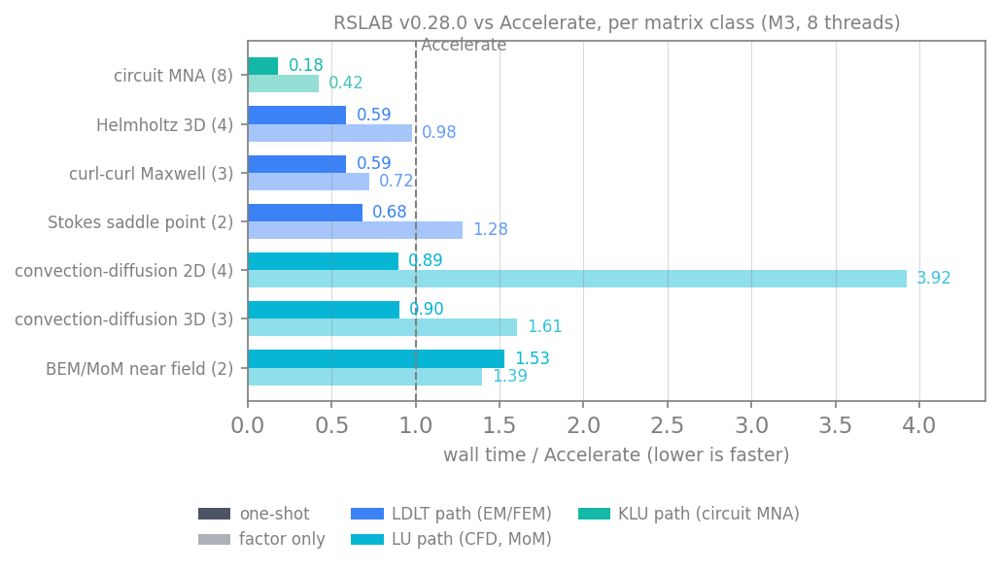
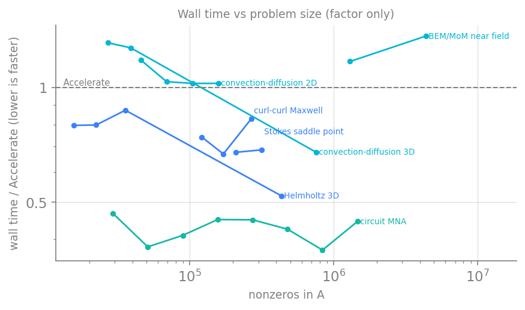

# RSLAB

Rust Sparse Linear Algebra Backend: a sparse direct solver for real and complex
matrices, with three paths matched to their operator classes - symmetric LDLT
(Bunch-Kaufman), unsymmetric LU, and KLU for circuit-shaped matrices. The solver
core is pure Rust: no BLAS, LAPACK or MKL. Every factor also works as a
preconditioner for the built-in Krylov solvers.

[](LICENSE)

- `P^T A P = L D L^T` (complex-symmetric, PARDISO `mtype 6`), `P^T A P = L U`
  (unsymmetric, `mtype 13`), or a BTF block factorization (KLU-style), generic
  over `f64`, `f32`, `Complex<f64>`, `Complex<f32>`.
- Bit-identical factors across thread counts, validated over 180 SuiteSparse
  matrices. Defaults are deterministic: the ordering is picked by an exact race
  on measured fill, and nothing is measured implicitly at runtime.
- A-priori peak-memory and runtime estimates from the symbolic structure alone.
- Krylov layer: restarted GMRES (single and block), COCG, COCR, GCRO-DR
  recycling, warm starts.

Fork of [feral](https://github.com/jkitchin/feral), see [NOTICE](NOTICE). The
technical report [`docs/report/rslab.pdf`](docs/report/rslab.pdf) derives the
algorithms and carries the full evaluation.

## Install

```toml
[dependencies]
rslab = "0.28"
```

Python bindings: `pip install rslab`.

```python
import rslab
x = rslab.spsolve(A, b)              # one-shot, picks symmetric or unsymmetric
f = rslab.ldlt(A); x = f.solve(b)    # factor once, solve many; also rslab.lu(A)
k = rslab.klu(A_circuit)             # BTF + Gilbert-Peierls, then k.refactor(data)
```

The dtype selects the field, factor knobs are keyword arguments. See
[`python/README.md`](python/README.md).

## Usage

Analyze the pattern once, factor values many times, solve against one or many
right-hand sides.

```rust
use rslab::prelude::*;

// Symmetric: pass the lower triangle (i >= j).
let a = CscMatrix::<f64>::from_triplets(3, &[0, 1, 2, 1], &[0, 1, 2, 0],
                                        &[2.0, 2.0, 2.0, -1.0])?;
let sym = LdltSymbolic::analyze(&a)?;
let f = sym.factor(&a, &SolverSettings::default())?;

let x = f.solve(&[1.0, 2.0, 3.0])?;
let xs = f.solve_many(&vec![1.0; 3 * 4], 4)?;   // 4 RHS, row-major n x nrhs
let f2 = sym.factor(&a2, &SolverSettings::default())?;   // same pattern, new values
```

Unsymmetric matrices take the same shape through `GeneralCsc` and `LuSymbolic`.
`LdltSolver::factor(&a)` and `LuSolver::factor(&a, &settings)` are the one-shot
forms; `LdltSolver::tuned(&a)` returns the analyzed pattern plus the settings the
ordering race picked, so a sweep can reuse both.

### Circuit-shaped matrices

The KLU path adds a numeric-only `refactor` (frozen pattern and pivots) for
frequency sweeps and Newton steps, and a transpose solve for adjoints.

```rust
use rslab::prelude::*;

let sym = KluSymbolic::analyze(&a)?;             // BTF + per-block AMD + symbolic
let est = sym.estimate_memory::<f64>();          // before any numeric work
let mut f = sym.factor(&a, &KluSettings::default())?;

let x = f.solve(&b)?;
let xt = f.solve_transpose(&b)?;                 // A^T x = b on the same factors
f.refactor(&a2)?;                                // new values, no pivot search
let x2 = f.solve(&b)?;
```

### Solver in the loop

Static pivoting never fails, so the factor is always usable as a preconditioner;
the drop tolerance trades fill for iterations. The factor never depends on the
thread count, and the default `Threads::Auto { max: 4 }` caps at the measured
efficiency knee so concurrent solves coexist.

```rust
use rslab::prelude::*;
use rslab::{factor_general_lu, gmres_block, with_threads};

let opts = SolverSettings::preconditioner(1e-8).with_drop_tol(1e-2);
let m = LdltSolver::factor_with(&a, &opts)?;
let res = cocg(&a, &b, &m, 1e-10, 100)?;

// Keep both phases on one pool: factor bounded, then the RHS loop inside it.
let lu = factor_general_lu(&a2, &SolverSettings::default())?;
with_threads(4, || {
    for rhs in &batches {
        let _ = gmres_block(&a2, rhs, s, &lu, 1e-8, 400, 80)?;
    }
    Ok::<_, RslabError>(())
})?;
```

`Threads::Ambient` factors on the surrounding pool instead of a scoped one.

## API

```rust
use rslab::prelude::*;
use rslab::{BlrMode, FactorMethod, OrderingMethod, Threads};
use num_complex::Complex;

// Settings are one flat builder, shared by the LDLT and LU paths.
let opts = SolverSettings::exact()                  // or ::preconditioner(floor)
    .with_drop_tol(1e-2)                            // incomplete factor
    .with_blr(BlrMode::contribution_blocks(1e-6))   // low-rank compression
    .with_method(FactorMethod::LeftLooking)         // or Multifrontal
    .with_ordering(OrderingMethod::AutoRace)        // exact race, the default
    .with_thread_policy(Threads::Auto { max: 4 });

// A-priori: both estimates are pure functions of the analyzed structure.
let sym = LdltSymbolic::analyze(&a)?;
let est = sym.estimate_memory::<Complex<f64>>();
let ms = est.est_runtime_ms(2.0, 4.0);              // gflops, parallel speedup
if !est.fits_in(8 << 30) { /* over 8 GiB, pick another plan */ }

// A-posteriori: per call, no global state.
let f = sym.factor(&a, &opts)?;
let (nnz, d) = (f.factor_nnz(), f.diagnostics());
```

`gmres`, `gmres_block`, `cocg` and `cocr` accept any `LinearOperator` plus
`Preconditioner`; every factor implements `Preconditioner`, and a `Complex<f32>`
factor can precondition an `f64` GMRES through `LowPrecisionPreconditioner`.

With the `tuning` feature, `plan(&est, &budget, &hw, &calib)` turns an estimate
and a memory budget into concrete settings, using the calibration that
`cargo xtask calibrate` writes once per machine.

## Benchmarks

Corpus: structured-grid generators (curl-curl Maxwell, shifted Helmholtz,
Stokes/KKT saddle point, convection-diffusion, BEM/MoM near field) plus complex
SuiteSparse matrices. RSLAB runs its shipped default throughout, which caps at 4
workers while Accelerate uses all cores; on the convection-diffusion class that
cap alone costs 12-17%.

### vs Apple Accelerate (M3, 8 threads, 4k-200k)



Wall time divided by Accelerate's, so 1.0 is Accelerate and lower is faster:

| matrix class | factor only | one-shot (analyze+factor+solve) |
|---|:-:|:-:|
| circuit MNA (KLU path) | **0.42** | **0.18** |
| curl-curl Maxwell | **0.72** | **0.59** |
| Helmholtz 3D | **0.98** | **0.59** |
| Stokes saddle point | 1.28 | **0.68** |
| convection-diffusion 3D | 1.61 | **0.90** |
| BEM/MoM near field | 1.39 | 1.53 |
| convection-diffusion 2D | 3.92 | **0.89** |
| geomean over the three paths | **0.97** | **0.48** |

Factor only is the repeated-factorization cost, one-shot is what a caller solving
a system once waits for; both solvers race orderings inside their analyze, so the
one-shot column is like for like. Accelerate's AMX kernels own the small and mid
sizes and the ratio improves with the problem: Helmholtz crosses parity at ~1e5
nonzeros and reaches 0.46 at n=110592.

The classes that stay behind carry their own evidence notes: the saddle/KKT
family (small-node overhead and chain serialization,
`dev/research/saddle-vs-accelerate-2026-08.md`), the near-dense BEM/MoM blocks
(the medium-node kernel floor, `dev/research/ldlt-lu-m3-audit-2026-08.md`), and
convection-diffusion, where the factor is concurrency-bound: 59% of the thread
time is idle workers and 1 to 8 threads buys only 2.4-2.8x, so single-thread work
that would reach parity at ideal scaling lands 3x behind
(`dev/research/lu-convdiff-2026-08.md`).



The same measurement across every release, and the analyze-budget lever it
exposed, are in
[`dev/research/accel-release-history-2026-08.md`](dev/research/accel-release-history-2026-08.md).

### vs MKL PARDISO and faer (12 cores, 1k-110k, geomean factor time)

RSLAB sits between the two: 5.6x (LDLT) and 5.1x (LU) behind MKL PARDISO, 6.7x
and 2.7x ahead of faer, which has no symmetric path. The ordering race is worth
1.84x and 1.49x over a fixed default configuration.

### KLU path

On MNA-like matrices the KLU path factors 5-12x faster than the multifrontal LU
with 1.7-5.7x less fill, so a 20-point sweep runs 10-40x faster end to end.
Against SuiteSparse KLU (same structure: identical BTF block counts, fill within
1.5%), with the parallel per-block factor that `KluParallel::Auto` enables:

| n | factor | SuiteSparse | refactor | SuiteSparse |
|--:|--:|--:|--:|--:|
| 2k | **0.7 ms** | 1.1 ms | **0.26 ms** | 0.56 ms |
| 10k | **2.6 ms** | 5.9 ms | **1.0 ms** | 3.3 ms |
| 50k | **11.9 ms** | 33 ms | **5.3 ms** | 18.4 ms |
| 200k | **51 ms** | 135 ms | **24 ms** | 79 ms |

Refactor also pipelines the columns inside a dominant irreducible block
(NICSLU-style just-in-time waits on the frozen elimination DAG): 2.0-2.9x on the
work-heavy SuiteSparse circuit matrices, still bit-identical.

### Accuracy and estimates

RSLAB solves 24/31 attempted SuiteSparse matrices below `1e-8` relative residual,
28/33 with the static-pivot factor used as a GMRES preconditioner. What it cannot
factor exactly it declines; faer and Accelerate return garbage with an OK status
on five of those. The memory estimate holds at ~1.3x measured in geomean and
never under-predicts.

Reproduce: `cargo bench --bench bench_suite --features matgen` with
`RLA_BENCH_FAMILY=sym|unsym` plus `benches/head_to_head.py`;
`benches/run_apple_silicon.sh` and `benches/accel_story.py` for the Accelerate
figures; `cargo bench --bench klu_circuit` for KLU.

## Architecture

- Left-looking supernodal by default: each panel pulls BLAS-3 updates from its
  factored descendants, then a blocked in-place panel factorization, and is freed
  once its last consumer is done. Multifrontal is an option.
- KLU: Hopcroft-Karp maximum transversal plus Tarjan SCC for the BTF form,
  per-block AMD, Gilbert-Peierls LU with threshold pivoting. Independent blocks
  run in parallel behind a deterministic structural gate.
- Parallelism: rayon over the assembly tree with SIMD `gemm` Schur updates in a
  scoped pool; the KLU pipeline uses OS threads directly.
- 32-bit index compression for `n < 2^31`, adaptive-precision low-rank BLR tail,
  static pivot reuse for fixed-pattern sequences.

## Cargo features

Default is the pure-Rust solver core. `matgen` adds the test-matrix generators,
`matgen-download` the SuiteSparse / Matrix Market fetcher, `tuning` the hardware
probe, calibration cache and budget planner.

## License

MIT, Copyright (c) 2026 Milan Rother. Fork of feral, Copyright (c) 2026 John
Kitchin, also MIT. See [LICENSE](LICENSE) and [NOTICE](NOTICE).

Consulting, integration and commercial support:
[milanrother.com/consulting](https://milanrother.com/consulting/)
