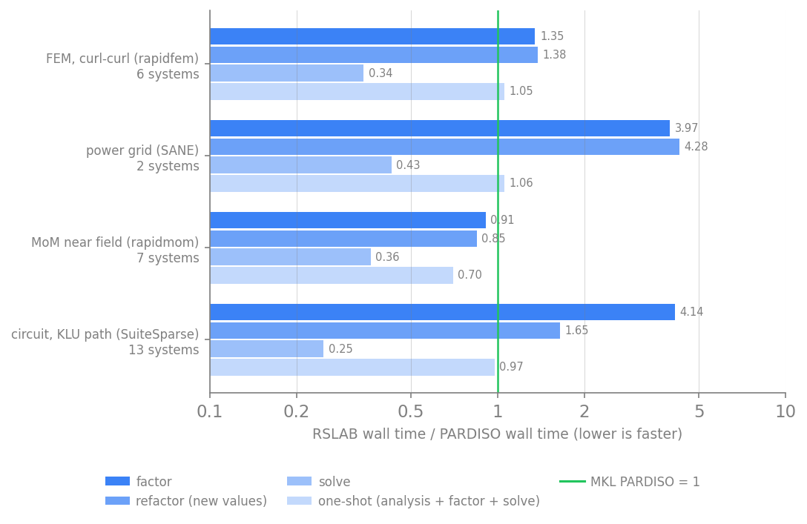

# RSLAB

A sparse direct solver for real and complex matrices in pure Rust: no BLAS,
LAPACK or MKL. Three paths:

- **LDL^T** (Bunch-Kaufman) for symmetric and complex-symmetric matrices,
- **LU** (threshold pivoting) for general unsymmetric matrices,
- **KLU** (block triangular form, per-block Gilbert-Peierls LU) for
  circuit-shaped matrices, with a numeric-only refactor for sweeps.

Generic over `f64`, `f32`, `Complex<f64>` and `Complex<f32>`. The factor is
bit-identical for every thread count, memory and flops are estimated from the
analysis before any numeric work, and every factor doubles as a preconditioner
for the built-in Krylov solvers (GMRES, block GMRES, COCG, COCR).

[](LICENSE)

## Install

```toml
[dependencies]
rslab = { git = "https://github.com/milanofthe/rslab", tag = "v1.0.0" }
```

```bash
pip install rslab
```

## Usage

```rust
use rslab::prelude::*;

// Analyze the pattern once (symmetric: lower triangle), factor values many times.
let s = SolverSettings::default();
let sym = LdltSymbolic::analyze(&a, &s)?;
let f = sym.factor(&a, &s)?;
let x = f.solve(&b)?;
let f2 = sym.factor(&a_next, &s)?;                           // same pattern

// Unsymmetric: GeneralCsc with LuSymbolic, or KluSymbolic for circuits.
let ks = KluSettings::default();
let mut k = KluSymbolic::analyze(&g, &ks)?.factor(&g, &ks)?;
k.refactor(&g_next)?;                                        // no pivot search

// A never-failing factor as a preconditioner.
let m = LdltSolver::factor(&a, &SolverSettings::preconditioner(1e-8))?;
let res = cocg(&a, &b, &m, 1e-10, 100)?;
```

```python
import rslab
x = rslab.spsolve(A, b)          # one-shot, LDL^T or LU by symmetry
f = rslab.lu(A); x = f.solve(b)  # factor once, solve many
sym = rslab.analyze(A)           # analysis alone, then sym.factor(A_k) per sweep point
```

The [API documentation](https://docs.rs/rslab) covers the settings, threads,
diagnostics, estimates and logging; the Python reference is
[`python/docs/api.md`](python/docs/api.md).

## Performance

Against MKL PARDISO on 28 systems exported from production codes (FEM,
power grids, MoM near field, SuiteSparse circuits), 12 threads each, wall
time relative to PARDISO (below 1 is faster), geomean per class:

| class | factor | refactor | solve | one-shot |
|---|:-:|:-:|:-:|:-:|
| FEM curl-curl (6) | 1.35 | 1.38 | 0.34 | 1.05 |
| power grid (2) | 3.97 | 4.28 | 0.43 | 1.06 |
| MoM near field (7) | 0.91 | 0.85 | 0.36 | 0.70 |
| circuit, KLU path (13) | 4.14 | 1.65 | 0.25 | 0.97 |

One-shot is analysis, factorization and solve.



Reproduce with `python benches/pardiso_corpus.py <corpus>` and
`python benches/pardiso_corpus_plot.py`.

## Design

- Left-looking supernodal LDL^T and LU, parallel over the elimination tree in
  a scoped rayon pool (`Threads::Auto` predicts the worker count, capped at 4
  by default), SIMD GEMM updates.
- Orderings: AMD, AMF, RCM and parallel nested dissection, raced on the
  exact fill of each candidate.
- Every tuning constant (race gates, dissection, amalgamation, kernel and
  solve blocking) is a setting, with the tuned value as default.
- Supernodal, tree-parallel solves on the factor's panels.
- KLU: maximum transversal and Tarjan SCC for the block triangular form,
  per-block AMD, Gilbert-Peierls LU; independent blocks factor in parallel.

## License

MIT, Copyright (c) 2026 Milan Rother. RSLAB started from
[feral](https://github.com/jkitchin/feral), Copyright (c) 2026 John Kitchin,
also MIT. See [LICENSE](LICENSE) and [NOTICE](NOTICE).

Consulting, integration and commercial support:
[milanrother.com/consulting](https://milanrother.com/consulting/)
